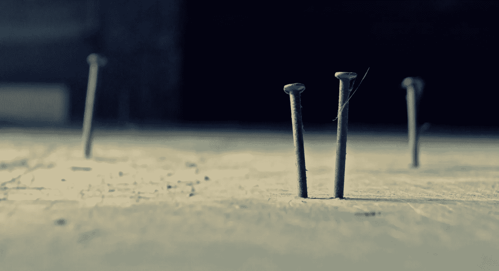

# 如果技术不是问题，它可能不是解决方案

> 原文：<https://medium.com/swlh/if-technology-isnt-the-problem-it-s-probably-not-the-solution-afa14b272481>

Whack! Nails by [Adam Rosenberg](https://www.flickr.com/photos/adamrosenberg/6344314107/in/photolist-aECgxZ-8Ju8zX-anhgfY-di8DSc-9p5rdR-7xvEKH-7jkiDp-7joVBf-FcFG3y-fxpJ2F-fJi3Kf-2FduhD-am9WQA-7joPVo-2T4Ya-fSC3xr-7joUyY-7jkdoT-ccAK4Q-dXAerS-7joQKN-e62ENk-ETxdY-7jkcwZ-8hed3Z-7jkjuK-bwz17R-8hhsY1-v3dgFs-7jkep2-4Hgqsq-7jpePs-9nn1mk-X5bdc-8hed5T-7jp9My-s9fcp-3eYic5-6SYgst-6nm3Vd-icas2H-dBgsh3-3c8X62-fwoyVC-QyMQ4r-5E1Xqz-96VdSv-9pUYfU-73vPEt-UCsQ4Y)

我做了至少十年的锤子。每天醒来，我都会寻找钉子，这样我就可以狠狠地把它们送回家。我遇到的任何问题都需要(巧合的是)相同的工具。我是多么幸运成为我:锤子！到处都是钉子！