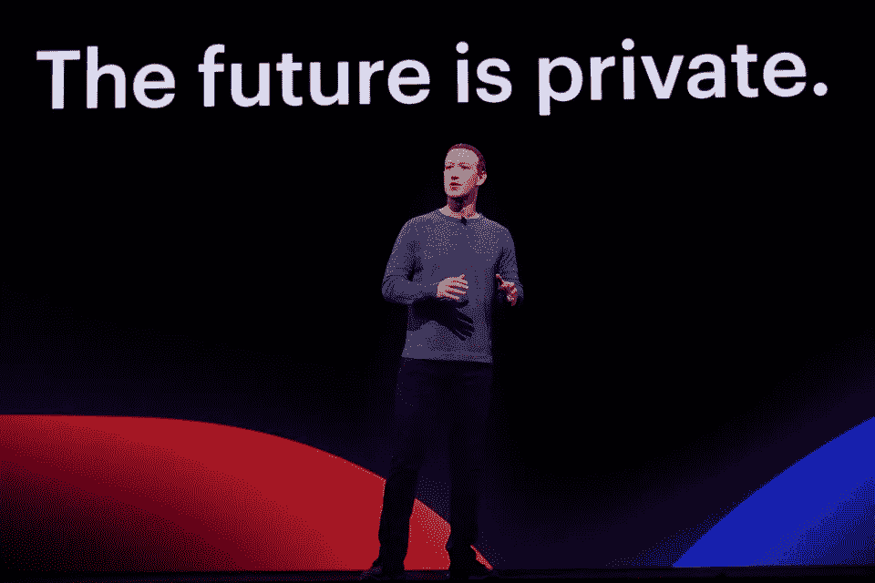

# 如果未来是私有的，未来不可能是脸书

> 原文：<https://medium.com/swlh/if-the-future-is-private-the-future-cant-be-facebook-71e305510e91>

## 我们永远不会在一个旨在提取和利用我们个人信息的网站上找到隐私

image via Facebook

未来是私人的。

脸书首席执行官马克·扎克伯格显然喜欢这四个词——无论如何，足够让它们出现在[身后的巨大屏幕上，当他发表主题演讲时…](https://www.google.ca/amp/s/www.theverge.com/platform/amp/2019/4/30/18524188/facebook-f8-keynote-mark-zuckerberg-privacy-future-2019)