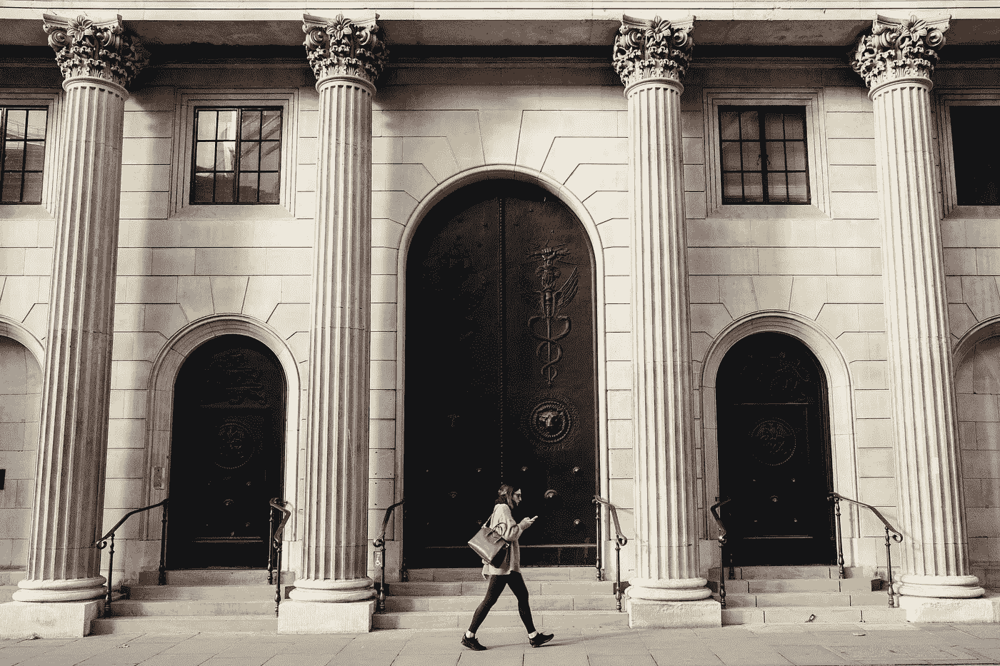

# 如果你想感觉自己是个无名小卒，去找金融贷款人谈谈吧

> 原文：<https://medium.com/swlh/if-you-ever-want-to-feel-like-nobody-go-talk-to-a-financial-lender-95062fc5fa67>

## 让你成为“重要人物”的标准

Photo by [Robert Bye](https://unsplash.com/@robertbye?utm_source=unsplash&utm_medium=referral&utm_content=creditCopyText) on [Unsplash](https://unsplash.com/search/photos/bank?utm_source=unsplash&utm_medium=referral&utm_content=creditCopyText)

为了成为真正的大人物，社会对我们要求很多。我们应该有良好的信用记录、婚姻状况、一些存款和一些资产。

虽然这些对你个人来说可能都不重要，但对今天的现状来说却很重要。没有…