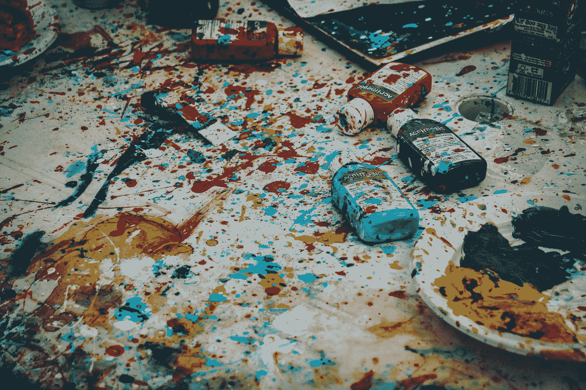

# 如果你认为营销是一门创造性的学科，那你就错了

> 原文：<https://medium.com/swlh/if-you-think-marketing-is-a-creative-discipline-youre-doing-it-wrong-8b3d3146b6ad>

Photo by [Ricardo Viana](https://unsplash.com/@ricardoviana?utm_source=medium&utm_medium=referral) on [Unsplash](https://unsplash.com?utm_source=medium&utm_medium=referral)

出于某种原因，许多有创造力的人被吸引到市场营销中来。它对艺术家有某种吸引力，就像我们都被告知，当你试图让你真正的艺术起飞时，这是谋生的最佳方式。

平面设计师通常是另一种媒介的艺术家。广告撰稿人经常在博客上写小说、短篇故事或诗歌