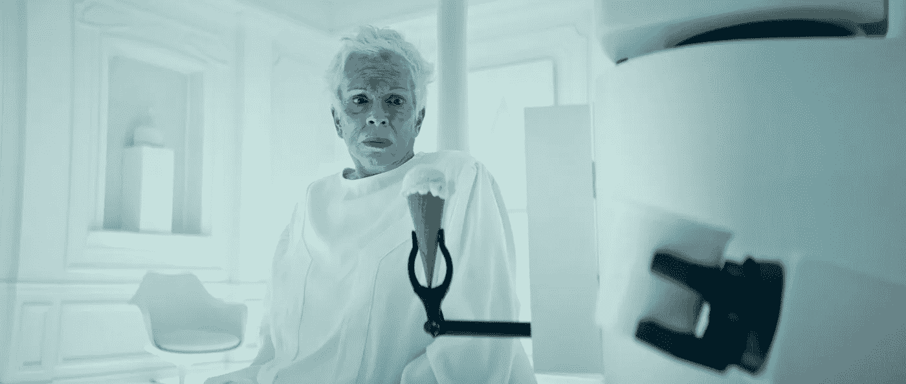

# 如果你想有独创性，就要学会热爱传统

> 原文：<https://medium.com/swlh/if-you-want-to-be-original-learn-to-love-convention-8f4b1d62dc1c>

我喜欢传统。作为一个致力于促进创造力和原创思维的人，这似乎有点违反直觉，但请允许我解释一下。

每一个创造性的范畴都有一系列既定的惯例、潜在的模式或公式，该范畴内几乎所有的例子都基于这些惯例、模式或公式。大多数电影遵循三幕结构…