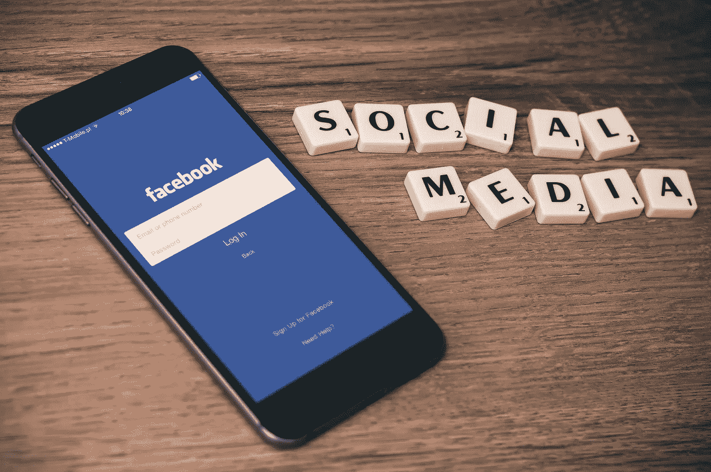

# 如果你不使用内容营销，你就在赔钱

> 原文：<https://medium.com/swlh/if-youre-not-using-content-marketing-you-re-losing-money-ef1295633340>

# 什么是内容营销？

内容营销被定义为:“试图通过向目标受众分发潜在有用的信息内容来吸引客户的营销，而不是以传统方式宣传产品和服务。”

基本上，内容营销是指你使用博客、视频和信息图表等内容来帮助你的受众了解某个主题或他们遇到的某个问题，而不是仅仅使用这些内容来销售你的产品或服务。

做正确的事非常重要。[根据 CMI](https://contentmarketinginstitute.com/2017/10/stats-invest-content-marketing/) 的数据，拥有博客的小企业比没有博客的小企业多获得 126%的销售线索增长。

有了这样的统计数据，谁不想要内容营销呢？如果你想要更多的线索和销售，但你不知道如何获得它们，你想利用内容。

# **为什么需要内容营销:好处**

关于内容营销的好处还有很多其他数据:

*   内容营销的转换率**比其他方式高六倍**。
*   在阅读了博客上的推荐后， **61%的美国在线消费者**进行了购买。
*   与付费搜索相比，内容营销的每美元收益是前者的三倍。

但是内容营销不仅仅是带来商机。当你在内容中使用正确的行业关键词时，它会给你的网站带来流量，因为你会在搜索结果中显示得更靠前。这导致更多的品牌知名度。

知道你的人越多，你的流量就越大。

随着流量和品牌知名度的增加，你可以开始与你的观众建立信任。信任你的观众会和你建立关系。相信你的观众会向你购买。

用内容营销看事情如何牵一发而动全身？

如果做得好，内容营销可以建立你在受众中的可信度和权威性。你可以通过创建内容来教育和向观众展示你理解他们的问题并想帮助他们解决问题。如果你把你的内容作为廉价的推销，你不会看到结果。

所以你已经建立了信任和信誉。现在怎么办？现在，您可以使用有针对性的内容来推动观众完成他们的购买之旅。通过创建“漏斗顶端”教育片段，您在受众的研究阶段为他们提供了帮助。接下来，你可以用更长、更详细的内容向观众展示如何解决他们的问题。这些将是你的漏斗底部件。

不确定[买家的旅程是什么](https://vollcontentmarketing.com/blog-2/whats-a-buyers-journey)？这基本上是顾客在购买之前要经历的过程。从研究阶段到购买阶段，尤其是购买你的产品或服务阶段，你都要帮助他们。

而内容营销最好的部分呢？内容永存。做得好的话，只需要一点点维护，内容就会不断地给你带来流量和线索，而不像广告那样需要持续不断的资金来维持运营，在原创内容产生后不需要再花任何钱。

因此，我们知道内容营销对发展您的业务极为有益。但是内容营销到底是由什么构成的呢？

# 内容类型

当你想到内容营销，你可能会想到博客。这是真的:博客是内容营销的重要组成部分。但是还有很多其他的东西也可以被认为是内容。这里列出了一些你应该在营销策略中使用的内容。

## 1.社会化媒体

社交媒体是企业最好的朋友。今天，全球有[34.84 亿人使用社交媒体](https://www.smartinsights.com/social-media-marketing/social-media-strategy/new-global-social-media-research/)。这些人平均每天在社交媒体上花费[2 小时 16 分钟](https://blog.hootsuite.com/simon-kemp-social-media/)。不仅仅是在网上，尤其是在社交媒体上。在设备上滚动会花费很多时间。难道你不想花些时间去了解你的公司及其产品或服务吗？

## 2.录像

你知道在你的主页上放一段视频可以让你的转化率提高 20%甚至更多吗？视频在营销中越来越重要。如今制作视频并不难。你真正需要的只是一部智能手机和一些有趣的话。但是请不要只是推销你的产品。

用你的视频来教育或告知你的观众。展示您的产品解决了观众难以解决的问题，但不要在整个视频中大声说出产品并谈论它，只需解释问题，展示如何解决它，然后结束视频。你不必大声说你使用的是你的产品——观众已经知道了，因为他们在你的网站或社交媒体页面上。通过教育展示你产品的价值——而不是推销——然后观察销售线索。

## 3.信息图表

你知道吗[信息图表可以增加高达 12%的网络流量](https://blog.hubspot.com/marketing/visual-content-marketing-strategy)？人们喜欢看图像，所以图像密集型信息图一直表现良好。如果你想传达统计数据或者你有一步一步的指示，你应该使用信息图。跟随有文字和插图的指示的人比跟随没有插图的指示的人表现好 [323%。](https://blog.hubspot.com/marketing/visual-content-marketing-strategy)

## 4.个案研究

案例研究是一种很好的方式，可以向你的受众证明你的产品或服务就像你说的那样有效，而且效果很好。案例研究应该侧重于展示使用中的产品/服务以及使用你的产品/服务后的最终结果的图片。如果你能从案例研究中提到的人那里得到一些引用，那就更好了。他们表明你的产品是可靠的，值得信赖的，值得他们花钱。

## 5.电子书

电子书是一个很好的潜在客户生成工具，因为它们是门控内容。这意味着感兴趣的人必须给你他们自己的信息，才能访问电子书，通常是他们的姓名和电子邮件。然后，您可以在营销自动化活动中使用这些信息，让他们在购买者的旅程中走得更远，最终达成购买。此外，这有助于显示你是行业内知识渊博的权威，让他们——你猜对了——更加信任你。

## 7.面谈

面试是展示你公司人性真实一面的好方法。你可以采访员工，询问他们最喜欢为你的公司工作的什么，或者采访客户，询问他们为什么选择使用你的产品。你可以就社交媒体影响者最近完成的一个项目采访他们，这个项目使用或展示了你的产品。这真的很简单:你需要的只是一部智能手机和一些好问题。然后，你可以在博客上(如果你在视频下面发布采访的文字记录，会得到额外的奖励)或社交媒体上或产品页面上使用采访。

## 8.网络研讨会

如果你想成为行业内知识渊博的领导者，你应该考虑举办一次网上研讨会。73%的营销和销售领导表示[网络研讨会是产生优质销售线索的最佳方式之一](https://blog.hubspot.com/marketing/are-webinars-dead-how-to-make-a-webinar)。为什么？因为如果他们报名参加你的网上研讨会，他们已经对你的行业感兴趣了。

不需要很长时间，30-60 分钟就够了，你可以就一个你是专家但他们需要帮助的话题教育你的听众。此外，观众必须注册参加网上研讨会，这样您就可以获得他们的联系信息，以便在以后的活动中使用。

## 9.时事通讯

与普遍的看法相反，电子邮件简讯并没有消亡。不相信我？根据 Hubspot 的数据，[电子邮件每花费](https://blog.hubspot.com/marketing/email-marketing-stats)1 美元就能产生 38 美元。这样的投资回报率怎么样？诀窍是制定一个你能坚持的时间表。你的时事通讯需要可靠才能被信任。此外，如前所述，不要只是用推销来填充。加入其他有趣的行业新闻和教育内容——你的观众想知道的事情。再次强调，这一切都是为了让自己成为一个值得信赖的行业领导者。

信任=销售。

# 底线

内容营销对发展你的业务至关重要。它增加了你的观众的信任和参与，这反过来可以增加收入。

但是内容营销需要大量的工作和组织。如果你做得不对，你会伤害你的品牌，降低信任度。虽然它将永远为你工作，当内容有强关键字时，它将继续出现在搜索结果中，你仍然需要做一些维护。断开的链接和 404 错误会告诉潜在客户你不可靠。

您应该创建一个维护计划来回顾旧的内容，以确保所有的链接和行动号召仍然有效和相关。这可以在每个月的月底，或者一个季度一次，或者一年两次，取决于你制作的内容量。

如果你想要内容营销的好处，但你没有时间去做它的权利，我很乐意帮助。[今天就联系我](mailto:vollcontentmarketing@gmail.com)，了解适合贵公司及其目标的内容营销策略，或访问我在 https://vollcontentmarketing.com[的网站](https://vollcontentmarketing.com)。