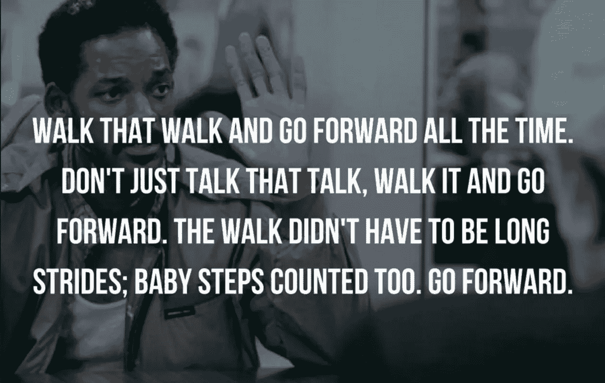
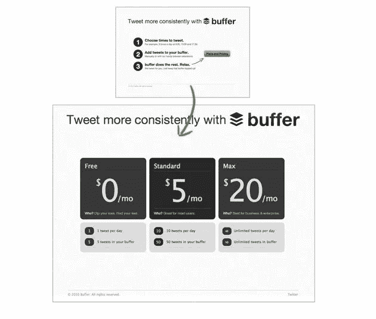

# 如果你花钱请人来打造你的 MVP，那么你可能推出得太晚了。

> 原文：<https://medium.com/swlh/if-youre-paying-someone-to-build-your-mvp-then-you-re-probably-launching-too-late-18969df77773>

你是一个非技术型的创始人，你读过[精益创业](https://en.wikipedia.org/wiki/The_Lean_Startup)，无数次被告知你需要快速推出一个 [MVP](https://en.wikipedia.org/wiki/Minimum_viable_product) 。但是你不会编程，你没有钱，没有联合创始人——只有一袋热情。

你变得非常沮丧，盯着 5k，10k，甚至高达 50k 的报价，还面临着失去一些股权来获得 MVP。

听起来像你吗？事情是这样的。

> 不管你的技术能力如何，如果你花钱请人帮你打造一个 MVP，那么你可能起步太晚了。

(这来自我，我两年来什么都没做)🤦‍♂️

不过说真的，你现在需要启动的所有东西，你都可以马上自己动手做，而且价格比一个手提袋还低。

我希望我早点意识到这一点。

Baby steps

在创业社区有大量的误导，我们作为非技术型创业者喜欢狼吞虎咽。

我们被告知，我们的 MVP 必须尽可能自动化，但不是完全自动化，拥有良好的代码库，以便我们在扩展时不会陷入技术债务，并且只包含潜在用户可能喜欢的精选功能**【我们假设】**。

我们还应该一个指标一个指标地跟踪指标，在 0.3 秒内找到适合市场的产品，并设计一个具有病毒循环的可扩展增长计划，否则我们就会失败。

Jackie Chan looking confused

如果你还没有任何牵引或验证，那么以上都是完全不相关的。现在关注多维度还为时过早。

最近，我对这一切感到非常沮丧。我受到了太多的误导，我决定开始戒毒，禁止自己参与推文、帖子、播客、见面会和全面的大牛💩。

我停止做**我认为**我应该做的事情，去**关注我为什么做这个**。

我认为现在筹集资金、推出闪亮的产品以及计算如何以每周 10%的速度持续增长还为时过早。

我花了两年时间准备种子前投资来资助我的 MVP。
我创造并放弃了许多概念，我花了一大笔钱乘坐维珍列车参观大烟酒店，在此期间，我一直在 A/B 测试宣传平台、财务模型，甚至是我在讨论中使用的语言。

就在几周前的一个晚上，我在曼彻斯特皮卡迪利大街下了火车，结束了伦敦一日游，回到家中，感觉有点泄气。就在那时，我意识到我的时间可以花得更好，专注于现在真正重要的事情，比如建立一个最低限度的可行体验(MVE)。

什么是 MVE？

我一直觉得 MVP 这个词有误导性，所以我创造了 MVE 这个词，让我自己在这些超级早期阶段有一个更加一致的焦点。

我认为，我们早期创业者不应该专注于打造这样的“产品”，而应该专注于创造一种给人们带来快乐的体验。

这是为什么？我们现在需要跟踪的唯一指标是我们的用户旅程让人们快乐。否则称为[验证](https://www.entrepreneur.com/article/325443)。
碰巧的是，你甚至不需要一个产品就能做到这一点。一开始甚至没有什么需要自动化，尽可能保持手动是有意义的。

[乔尔·加斯科因](https://joel.is/),[Buffer](https://buffer.com/)的创始人兼首席执行官在他所谓的他们的 MVP 项目上做得非常出色。你可以在这里阅读[他的故事](https://buffer.com/resources/idea-to-paying-customers-in-7-weeks-how-we-did-it)但是简单来说，Buffer 的 MVP 只有一个登陆页面和一个定价页面。

乔尔用它做的太棒了。他故意不推出产品，而是选择用三句话来解释他们的想法。他还在这些句子旁边放了一个闪亮的大 CTA，点击后会进入定价页面。

为什么这如此特别？

乔尔不仅证实了人们有一种被 Buffer 抓痒的渴望，还证实了他们是否愿意为此付出代价，以及愿意为此付出多少代价。

Buffer’s MVP

我可以分享的另一个例子来自 [Luke Massie](https://twitter.com/lukemassie) ，他是 [Vibe](https://www.vibetickets.co.uk/) 的创始人兼首席执行官。当我第一次见到 Luke 时，他告诉我 Vibe 的 MVP 非常小，甚至没有登陆页面。他们的最有价值球员是一个推特账户。
同样，卢克没有任何“真正的”产品，但他能够创造出一种快乐的体验，让**人们想要使用**，**与他们的朋友**分享**回来使用**。如今，Vibe 拥有一大批粉丝，甚至还在向新的领域扩张。

还有很多令人惊叹的企业是从类似 AirBnB 或 Groupon 这样的公司起步的——它们最初只是一个简单的博客和 Dropbox，除了一个解说视频什么都没有。

这些都是真正验证和不使用花哨的 MVP 的很好的例子。

那么我们如何建立我们的 MVEs 呢？

首先，不管现在让你的概念落地看起来有多困难，都不要因此而退缩。不管进入壁垒有多复杂，你都可以 100%做到这一点。

把你的概念简化，一次又一次地简化，直到你只剩下最基本的东西，但足以给早期用户带来快乐的体验。

请记住，在简化过程中，你将不得不远离你头脑中所有的歌唱和舞蹈产品，并继续专注于以最简单的形式创造一种体验。

我最近偶然发现了一个叫胡安·菲利佩·坎波斯的人，他创建了这个谷歌文档，链接了 81 个工具，我们这些非技术型的创始人可以用它来构建和发布我们的概念，而不需要任何技术专长。

所以你还在等什么…😉😉

我花了 2 年时间试图资助一个我根本不需要的 MVP，并在 2 天内构建了所需要的东西，而这一切都没有编写一行代码。

不要做我做过的事情，利用现有的资源，从今天开始。

✌ —安迪。

注:我总是乐于与人交流和聊天，我在 [Instagram](https://www.instagram.com/welcometoandy/) 和链接的[上最活跃，有时也会在](https://www.linkedin.com/in/welcometoandy/) [Twitter](https://twitter.com/credibleandy) 上闲逛。