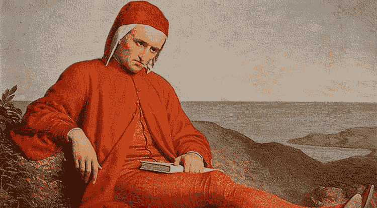

# 如果你被卡住了，重新调整这两个步骤(不那么简单)

> 原文：<https://medium.com/swlh/if-youre-stuck-realign-with-these-2-not-so-simple-steps-f1caf13b2c35>

[Dante](http://www.important7.com/wp-content/uploads/2018/06/Dante-Alighieri1.jpg)

在我即将出版的书中，我讲述了我如何经历抑郁和心碎的故事。然而，我陷入这种可怕困境的部分原因是我自己被卡住了。

因此，我知道陷入困境是生活中最糟糕的模式之一；感觉自己迷失了方向。