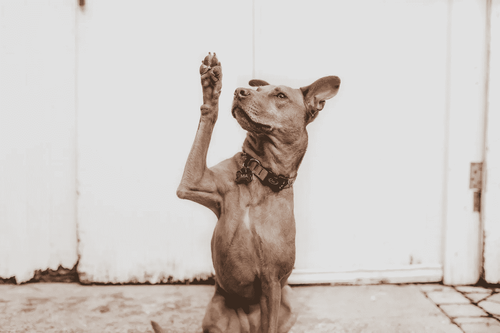

# 如果你被困住了，那么你就掉进了这四个陷阱中的一个

> 原文：<https://medium.com/swlh/if-youre-stuck-then-you-ve-fallen-into-one-of-these-four-traps-1fcf6e506184>

Photo by [Elijah O’Donnell](https://unsplash.com/photos/dfdyIYnRwqA?utm_source=unsplash&utm_medium=referral&utm_content=creditCopyText) on [Unsplash](https://unsplash.com/t/people?utm_source=unsplash&utm_medium=referral&utm_content=creditCopyText)

## 不快乐是不知道自己想要什么，为了得到它而拼命。唐·赫罗尔德

大多数人想要前进，实现他们的目标，过上充实的生活，但是经常发现自己被困在一个看起来像仓鼠轮子的东西上，在这里来来回回地跑，但是从来没有去过他们想去的地方。

当我们发现自己陷入困境时，有时我们认为答案是更努力地工作，在办公室花更多的时间，或者强迫自己改变。

通常，我们越是抗争、推动和努力，事情就变得越糟糕。就像在流沙中。

也许你现在感觉陷入了困境，这可能是因为你已经落入了这四个陷阱中的一个。

# 你不清楚你想要什么

对许多人来说，这是一个挑战:我们不知道自己想要什么，在努力寻找的过程中，我们把自己和周围的人逼疯了。

如果你不知道你要去哪里，你就很难去任何地方。除非你弄清楚**你想要什么**，否则你永远不会取得可持续的进步。

> "你最高的渴望和最深刻的价值观是你最真实的愿望."罗伯特·弗里茨

我们很多人都知道自己应该渴望什么，但却不知道自己真正渴望什么。我们经常混淆别人告诉我们应该想要的东西和对我们有内在意义的东西。

我们经常看到这种情况发生在那些追求金钱和地位的人身上，他们认为这是更好生活的答案。我们用对我们来说重要的东西来交换我们认为未来重要的东西。

我们花了太多的时间和精力去满足别人的期望，却很少关注自己的期望。当我们每天对生活做出反应时，我们的潜力处于休眠状态。

只要你继续向别人寻求你应该做的事情，你就会在我之前提到的仓鼠轮上得到很好的锻炼。

如果你发现你不确定你想要什么，那么这个问题值得回答。你对自己的价值观和愿景越清晰，你的生活就会变得越光明。

如果你认为这可能是你开始的好地方，那么看看我的[发现你的价值观指南](https://pages.convertkit.com/47255dd5c9/d44858f307)。

你可能会问，“……但是我已经知道我想要什么，为什么还感觉遥不可及？”

# 你正在妨碍你自己

大多数人对待生活的方式从根本上来说是有缺陷的(这一点对我来说是个大问题)。我们没有去追求生活中最有意义和最重要的东西，而是努力让自己感觉更好。

*   我们感觉不到动力，所以我们看了一本书试图增加动力。
*   我们还没有灵感，所以我们等待…只是..稍微长一点。
*   我们发现我们正在做的事情非常不舒服，所以我们抓住我们的手机逃离。
*   我们累了，所以我们等到明天。

想要感觉更好往往与我们渴望的进步直接冲突。

> “如果你被催眠，认为没有这个、那个或其他东西就不会快乐，那你就被困住了。”安东尼·德梅洛

你想要感觉更好还是想要创造你渴望的生活？

如果我们的目标是感觉更好，那么我们可能会花时间和精力来摆脱焦虑，打开电视来寻求一点逃避，而不是接受我们的焦虑和选择有价值的行动。

由于这样或那样的原因，我们感到不舒服，所以我们拿起手机，迷失在 Instagram feed 的无休止滚动中，而不是卷起袖子做重要的工作。

试图感觉更好会推迟我们最想要的东西。

**当你向目标迈进时，你自然会经历痛苦和不适。**

我们需要[学会有效地处理我们不喜欢的事情](/swlh/three-simple-questions-to-ask-when-you-doubt-yourself-7f0f4ebe891a?source=friends_link&sk=3c06e3c57c56048016787c9c09e80f04)，同时做对我们来说重要的事情，实现我们的目标，而不是试图“做对”。

也许你走出自己的舒适区没有问题，而且你不害怕采取行动。相反，也许你发现自己不断地对自己的进步感到沮丧，觉得永远都不够。

如果是这样，下一个是给你的。

Photo by [Camylla Battani](https://unsplash.com/photos/AoqgGAqrLpU?utm_source=unsplash&utm_medium=referral&utm_content=creditCopyText) on [Unsplash](https://unsplash.com/search/photos/questions?utm_source=unsplash&utm_medium=referral&utm_content=creditCopyText)

# 你不停地问自己问题，这会扼杀你的动力

有高能问题，也有低能问题。

问一些耗尽我们精力的问题是人类的天性。我们是解决问题的机器。

我们的第一本能是去寻找问题，问自己这样的问题…

*   我今天表现如何？我今天做错什么了吗？)
*   *我如何防止这种情况再次发生？*
*   *我是怎么搞砸的？*
*   他们认为我做得怎么样？
*   他们高兴吗，或者我需要做些改变吗？
*   *怎么了？我该如何解决这个问题？*

问这些问题通常会将我们的注意力和精力引向问题所在——通常也是我们的问题所在。

我们每天都用我们提出的问题来打击自己。

成就任何有意义的事情都需要巨大的动力。如果我们一生都在踢自己的屁股，就很难找到动力。

如果我们不直接问什么是错的，而是关注什么是对的。如果我们不是寻找一个问题去解决，而是寻找一个结果去创造呢？

我们可以通过把我们问自己的问题从低能转移到高能来做到这一点:

*   *什么是对的？*或*什么在起作用？*
*   什么使它正确？或*为什么会起作用？*
*   什么是理想的？
*   还有什么不是我想要的方式？
*   *创造我想要的东西的下一步可能是什么？*

**一个高能量的问题能让你在探索你下一步想要创造什么的时候感到更有价值。**

一个好的经验法则是，无论何时你用*什么*而不是*如何*开始提问，它们更有可能是一个高能量的问题。

*什么样的*问题授权和*如何授权*问题至关重要，通常会导致对我们自己和他人无益的判断。

你有时间再做一个陷阱吗？这个吸引了很多人。

# 你没有认真对待你的策略

我们有目标，我们制定策略来实现这些目标。但是，如果我们从来没有真正执行战略，我们为什么要期待成就呢？

你如何知道你的策略是否正在实施？

看看你的日历，看看你花的钱，看看你的精力去了哪里……你的策略在你如何花这三样东西上是明显的吗？

《哈佛商业评论》特写的作家、教授和商业顾问克莱顿·M·克里斯坦森说:“许多人陷入的陷阱是，把他们的时间分配给尖叫得最响的人，把他们的才华分配给能给他们带来最快回报的人。这是建立战略的一种危险方式。”

我认为这再次直接表明我们需要解决问题。当我们专注于构建我们最想要的东西的策略时，这些问题往往变得无关紧要。

但是**“…如果你决定把你的血、汗和泪投入到什么地方，这与你渴望成为的人不一致，你永远也不会成为那个人。”**

# 结论

当我陷入困境时，这是阻碍我的四个陷阱(它们也可能阻碍你):

1.  你不清楚你想要什么。
2.  你在妨碍你自己。
3.  你问的问题扼杀了你的动力。
4.  你没有认真对待你的策略。

对你来说现在是哪一个？

我们的行动带来自信，当我们明确我们想要什么，专注于我们正在创造的东西，并制定正确的策略时，我们就能实现我们生活中最想要的东西。

# 下载我的免费行政早晨计划！

[**点击此处**](https://www.createpurpose.net/executive-morning-plan) 并下载**早晨执行计划:通过控制你的早晨来提升你的表现**(没有收件箱和更多的任务清单)！

## 这篇文章发表在 [The Startup](https://medium.com/swlh) 上，这是 Medium 最大的创业刊物，拥有+423，678 名读者。

## 在这里订阅接收[我们的头条新闻](https://growthsupply.com/the-startup-newsletter/)。

