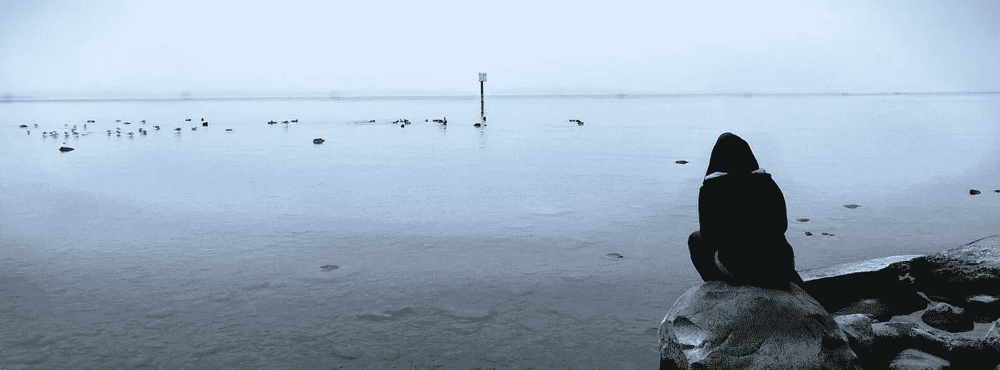

# 如果你不开心，停止这样做。

> 原文：<https://medium.com/swlh/if-youre-unhappy-stop-doing-this-23388b2eb6ca>

我承认我并不总是快乐的。大多数时候，但不总是。在过去的几个月里，我踏上了改变无意识行为的旅程，融入新的习惯并不断离开我的舒适区。我确信，我并不孤单。随着时间的推移，我注意到我是如何逐渐变得更快乐的。开心多了。不是一个快速的解决方案，也没有瞬间的喜悦，而是一个已经成为我生活中不变的美好源泉——一个我不想再错过的源泉。

虽然我可以看到所有的小变化如何给我的生活增加了积极的方面(或带走了消极的方面)，但我最初并没有意识到我以前的不快乐和不充分的感觉是建立在同一个基础上的:比较。

要么是在我自己的思想流中，要么是从外部引发的，在将我自己与想法、概念或其他人进行比较的意义上；或者在某种程度上，这种比较阻碍了我的进步，直到我设法把它翻转过来，用它作为“燃料”来点燃我。这个过程对我来说并不自然。致力于改变需要大量的工作、意识和意愿。

当我开始挖掘得更深一点时，发现心理学中有一个完整的理论是围绕这个建立的！[社会比较理论。](https://www.psychologytoday.com/us/basics/social-comparison-theory)这一研究领域涉及比较的多个方面，最终会对我们的幸福产生积极和消极的影响。

对我来说，这是一个信号，表明我不是一个人有这个问题，我敢打赌，如果你曾经遇到过不快乐的感觉，你会发现自己至少犯了以下一种错误。

# 越过我。

一开始，我发现自己有把现在的自己和过去的自己做比较的倾向。举个例子，几年前，我在国外住了一段时间，度过了一生中最美好的时光。我不断地遇见新的人，体验另一种文化，发现它总的来说令人兴奋和鼓舞。几年后，我发现自己陷入了一份普通的朝九晚五的办公室工作。没有激情，没有挑战，没有在短期内晋升的前景。我崩溃了，脑袋一直卡在过去。

> 我是怎么到这里的？

几个月来，我没能摆脱自己。总是抱怨但从不付诸行动。直到，后来很多自我发展的书，我战胜了恐惧，把自己的过去变成了灵感的源泉。现在，这种比较是我前进的唯一动力:我想再次移居国外。创造新的体验。在事业上出人头地。认识新的人。一直记着这个画面，当时我是多么的快乐，我真的找到了一条出路。移居国外并向前发展。

有些人无法摆脱长久的关系，有些人怀念年轻时的自由。不管是什么，只要我们把宝贵的精神时间花在过去，我们就无法在现在采取必要的步骤来创造改变。

让你现在的自我形象与你过去的积极状态相匹配，甚至超过它。

# 未来的我。

也许，你没有浪费时间去想你生命的前几个阶段，但是你让自己陷入了一个理想化的未来版本。哦，有一天，当你最终得到那份工作时，你会感到非常幸运！要是你已经在那里就好了。但是如果你永远也到不了那里呢？如果你不够好呢？你的老板永远看不到你真正的潜力？如果 10 年、15 年后，你仍然困在同一张办公桌前，做着完全相同的日常工作，那该怎么办？

> 停下来。

有梦想和目标是一回事，抛弃现在去幻想世界末日是另一回事。把自己和未来相比，你应该把皱眉变成微笑。一次梦想过山车之旅，它激励你，让你兴奋，一个让你更加努力工作的画面。它不应该以一个反映你现在的天启结束，X 年的老化。

利用你的白日梦:把它们变成一条鼓舞人心的道路，引导你现在的行动。

# 数字化的我。

我一直最喜欢的社交媒体应用曾经是 Instagram。以前，每当我登录时，我都会陷入滚动、点击、跟随的无尽循环中。重复一遍。我可以一次在这些数字世界里呆上几个小时。在某一点上，不可否认这个习惯严重影响了我的工作效率、睡眠、社交生活，是的，也影响了我的快乐程度。虽然我喜欢浏览帖子，窥探陌生人的生活，但这也让我非常难过。

*为什么我不能一直环游世界？他们怎么买得起那些昂贵的东西？我的生活是不是太无聊了？我现在应该做得更多，取得更大的成就吗？*

看着那些被过滤掉的，可能大部分都是假的，别人的叙述让我对自己的现实感到嫉妒和不安全。我一度决定删除手机上的应用程序。说实话，当我意识到一天中有多少次我无意识地回到方形图标曾经出现的地方，却发现一片空白时，我感到震惊。我从未意识到我对数字输入的依赖程度。

几周过去了，我一点也不在乎。我重新安装了一次，但几乎立即又删除了它。我仍然喜欢这些图片、视频和围绕它们建立的社区，但我不能否认没有它们我的生活会更加丰富。

从长远来看，将我们自己与他人的虚假社交媒体账户进行比较对我们没有好处。事实上，研究表明，过度使用这类平台会导致焦虑和抑郁症状的增加[。](https://www.sciencedirect.com/science/article/abs/pii/S0165032716309442)

一劳永逸地戒掉它？不需要。它是当今社会的一部分，限制和更有意识的使用可能是它所需要的。我仍然喜欢偶尔通过笔记本电脑访问 Instagram。然而，我确实消除了在手机上无意识滚动的习惯性和上瘾性。

# 除了我其他人。

社交媒体并不是我喜欢每天进行令人沮丧的比较的唯一方式。事实上，这个问题早在我们开始在 Snapchat & co .上分享我们看似奢华的假期之前就存在了。

这项始于 1992 年的研究要求 94 名大学生记录他们社会比较的细节。结果呢？毫不奇怪，幸福感明显下降。

我承认我也有责任。我总是很想看看我是如何与我的兄弟姐妹、朋友和同事保持一致的。我适合吗？我做事情的顺序正确吗？我应该继续追求我的职业目标、我的人际关系、学业成就吗？精神上把自己困在令人沮丧的思维模式的无尽循环中。

所有问题的答案都是:

> *没关系。*

如果你现在的成就和人生目标不符合社会规范，那也没关系。如果你想在 57 岁的时候重返大学，无论如何，去做吧。如果你想把事业放在孩子之前，那是你的选择，没有错。每个人的生活都是不同的，没有一个“完美”的顺序来划分里程碑，也没有一系列必须在结束时达到的成就。从来没有一个更好的时机去做我们想做的任何事，成为我们想成为的任何人！

远离不健康的比较方式，选择快乐和自由的思想。也许，就这一次，干脆不要去他妈的。