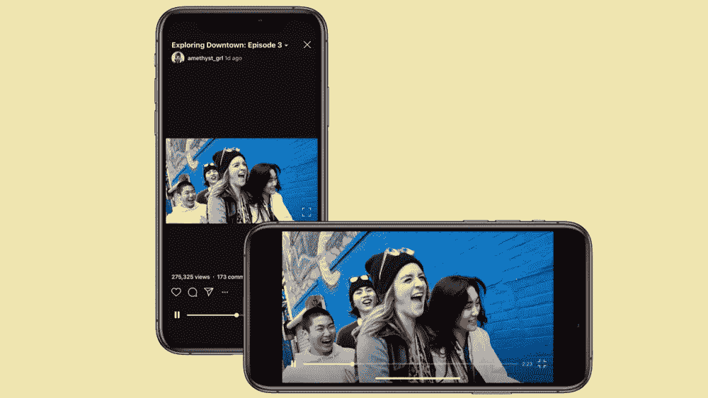

# IGTV 放弃了其垂直视频要求，但这有关系吗？

> 原文：<https://medium.com/swlh/igtv-abandoned-its-vertical-video-requirement-but-will-it-matter-864e4ed3403a>

告别 IGTV 里那些难看的裁剪视频。

为了吸引更多的人，观众和创作者，到这个苦苦挣扎的平台，IGTV 放弃了垂直视频的要求，转而支持水平和垂直视频。现在，在顶部和底部看不到那些丑陋模糊的线条或巨大的信箱…