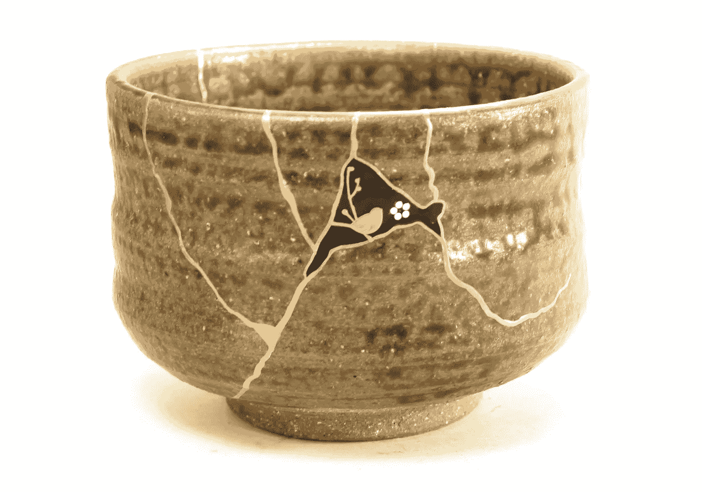

# 我是个失败者

> 原文：<https://medium.com/swlh/im-a-failure-4255db0a4b5b>

## 并引以为豪

我经历了人生中前所未有的失败，但我比以往任何时候都更有灵感和动力。

[fujina-maki-e-bird-cherry-chawan](https://www.etsy.com/listing/551287850/fujina-maki-e-bird-cherry-chawan?gpla=1&gao=1&&utm_source=google&utm_medium=cpc&utm_campaign=shopping_us_a-art_and_collectibles-fine_art_ceramics&utm_custom1=6d46a5ea-928c-4f67-a925-7cbb4d7fc276&utm_content=go_304499435_23159847755_83187526235_aud-301856857598:pla-139472349155_c__551287850&gclid=CjwKCAiAnsnjBRB6EiwATkM1XlMG9Fn1t8N8HnLR5_UJmcsYTowr7Z5u4wfrN39see06ylYcub1OMBoCNcoQAvD_BwE)

我在重新定义失败和羞耻的概念。我决定把我的失败视为一件值得骄傲的事情。我失败的尝试意味着我在努力，我在成长，我在前进。我没有因为所有的“不”而感到沮丧，而是选择像日本人那样看待我的大大小小的失败…