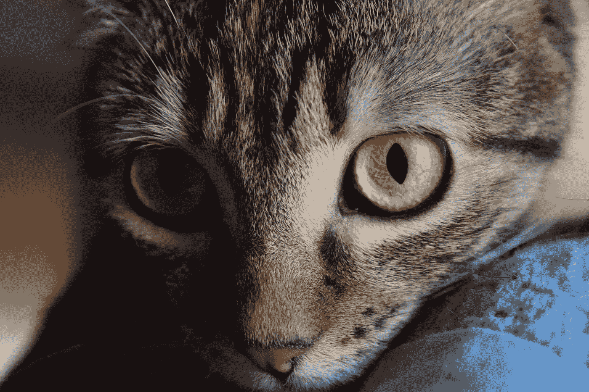

# 我害怕——如果我让你失望了怎么办？以下是如何克服它的方法

> 原文：<https://medium.com/swlh/im-afraid-what-if-i-disappoint-you-here-s-how-to-get-past-it-b36d8b73569e>

## 如何挖掘出我们的恐惧并克服它们

Photo by [Lucia Velez](https://unsplash.com/@luciaf1?utm_source=medium&utm_medium=referral) on [Unsplash](https://unsplash.com?utm_source=medium&utm_medium=referral)

## 所以，叫我胆小鬼吧，但我被困住了。

我已经有几天了。幸运的是，我已经准备好了一些短篇小说，所以我设法一瘸一拐地前进。但是预后并不好。