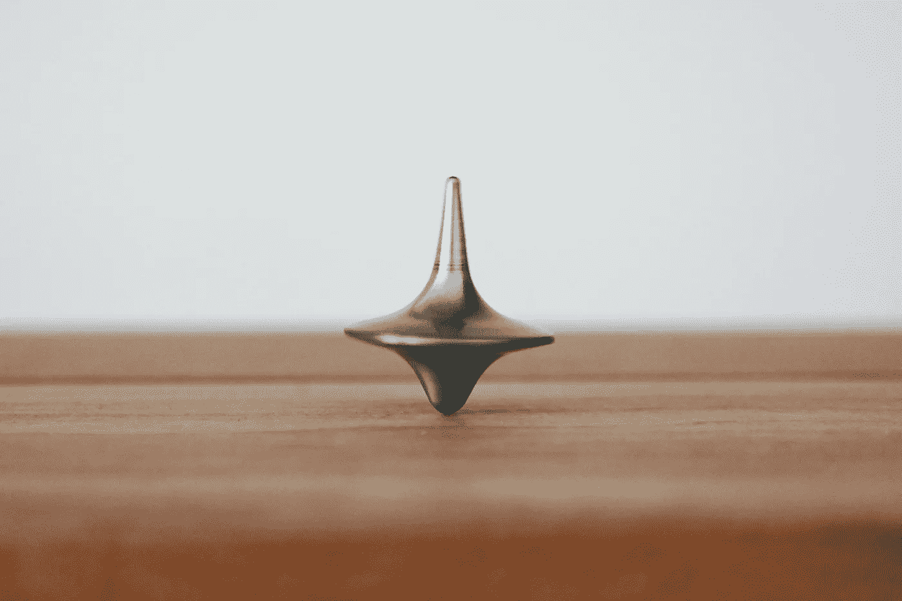

# 我没有实现工作与生活的平衡——以下是我能接受的原因

> 原文：<https://medium.com/swlh/im-not-achieving-work-life-balance-here-s-why-i-m-ok-with-it-66837627f7e5>

Photo by [Christophe Hautier](https://unsplash.com/@hautier?utm_source=unsplash&utm_medium=referral&utm_content=creditCopyText) on [Unsplash](https://unsplash.com/search/photos/balance?utm_source=unsplash&utm_medium=referral&utm_content=creditCopyText)

我要坦白一件事:我最近去度假了……并且工作了。我知道，我知道。均衡的人不会这么做。我请求我的朋友去泰国时“拔掉插头”,而我却在假期活动间隙偷偷写博客，这也是完全虚伪的。