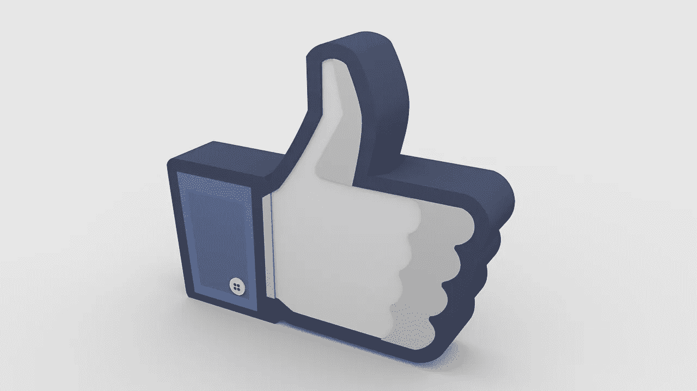

# 我不同意“分享”

> 原文：<https://medium.com/swlh/im-not-down-with-sharenting-c424b5ecbb95>

## 为什么我不在社交媒体上记录我孩子的生活

Image by [Mizter_x94](https://pixabay.com/users/Mizter_x94-2533164/?utm_source=link-attribution&utm_medium=referral&utm_campaign=image&utm_content=1748813) from [Pixabay](https://pixabay.com/?utm_source=link-attribution&utm_medium=referral&utm_campaign=image&utm_content=1748813)

我成长在 90 年代，那时人们喜欢现实生活中的事情，而不是竖起大拇指。我一直在努力融入社交媒体。当我发现我怀孕的时候，我没有在网上发布这个消息。我没有分享超声波照片，也从未宣布我儿子抵达脸书。他没有带着追随者来到这个世界…