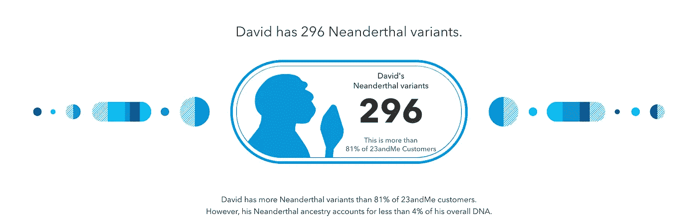

# 我有部分穴居人血统。这是好事吗？

> 原文：<https://medium.com/swlh/im-part-neanderthal-is-that-a-good-thing-1a6ec211600e>

My latest Update

## 我刚刚从 23andMe 收到了最新的 DNA 更新

# 刻板印象

尼安德特人被视为大块头——多毛且愚蠢。事实上，尼安德特人的大脑比智人更大，也更强壮。

另一个大的误解是，智人是他们的后代，按时间顺序排列…