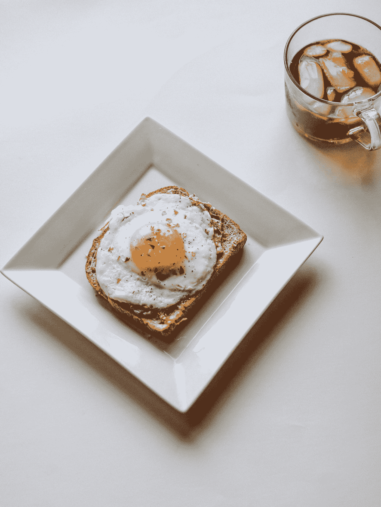

# 我为自己是千禧一代而自豪——听我说完

> 原文：<https://medium.com/swlh/im-proud-to-be-a-millennial-hear-me-out-23d1600df937>

Photo by [Ben Kolde](https://unsplash.com/@benkolde?utm_source=medium&utm_medium=referral) on [Unsplash](https://unsplash.com?utm_source=medium&utm_medium=referral)

哦，千禧一代…我们真的是最糟糕的，不是吗？至少，这是我们被告知的。不断地。每天在工作中，我都会想起我们这一代人是多么懒惰和娇惯——你知道我们也太敏感和脆弱了吗？

是的，我们中的许多人会纠正你使用“同性恋”和“弱智”这样的词，或者被一些看似无害的关于“厨房里的女人”的小笑话所冒犯。…