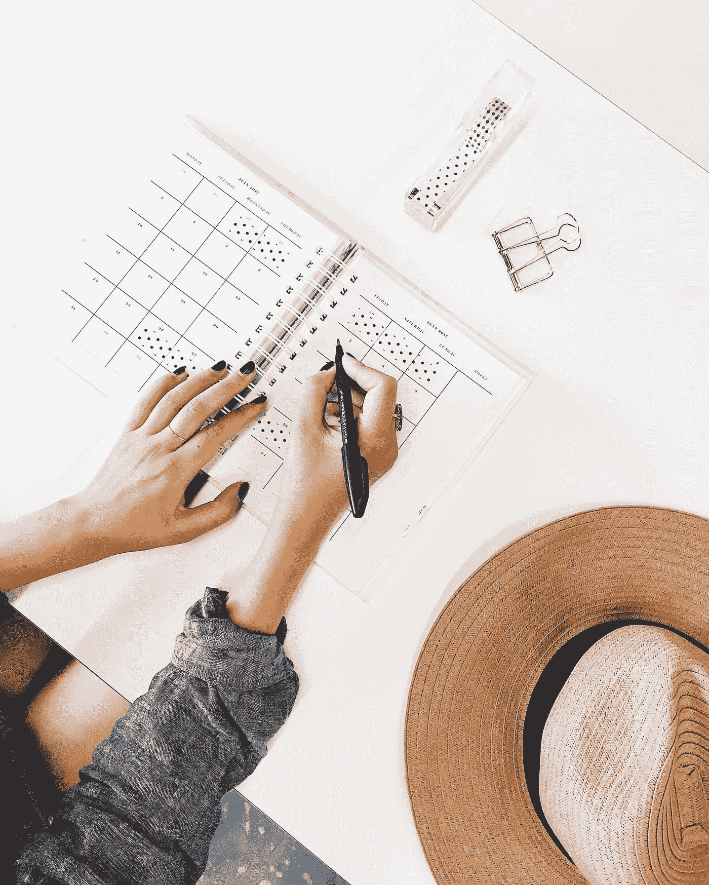

# 我害怕懒惰

> 原文：<https://medium.com/swlh/im-terrified-of-being-lazy-390fe5765ef7>

## 我们的文化奖励那些不停忙碌的人…

Photo by [STIL](https://unsplash.com/@stilclassics?utm_source=medium&utm_medium=referral) on [Unsplash](https://unsplash.com?utm_source=medium&utm_medium=referral)

根据我的社交媒体反馈，每个人都在同时做一百万件事情。一直走到再也走不动为止。他们正在度假，努力实现他们的商业目标，组建家庭，筹划婚礼，去吃饭或者和他们的宠物一起出去玩。难道我不应该利用我的“空闲时间”做同样的事情吗？