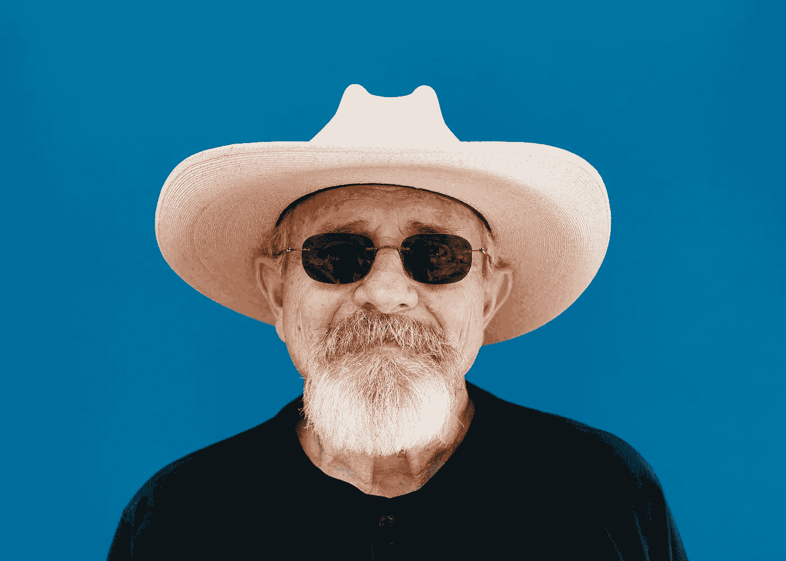
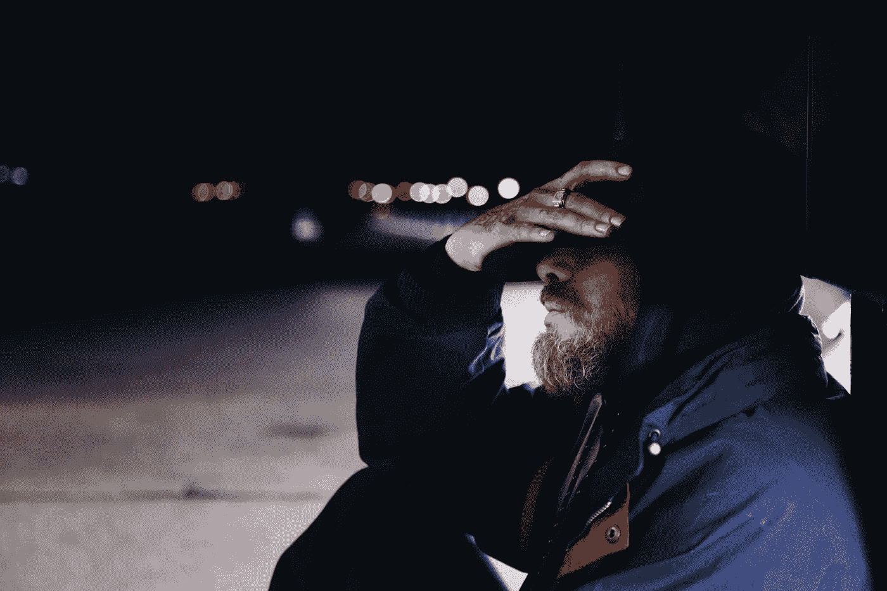

# 我是主角；我是赢家。

> 原文：<https://medium.com/swlh/im-the-main-character-i-m-the-one-who-wins-a8459915ba2>

## 嗨，我的名字是格雷格，我是一个配角。

## 创造角色，变得简单。

Photo by [Jared Sluyter](https://unsplash.com/@jaredsluyter?utm_source=unsplash&utm_medium=referral&utm_content=creditCopyText) on [Unsplash](https://unsplash.com/search/photos/old-man?utm_source=unsplash&utm_medium=referral&utm_content=creditCopyText)

> 我就是我，不管我认为我是什么或者你认为我是什么，因为我将永远是我，直到我死去的那一天。

韦氏词典认为，性格是构成和区分一个人的属性或特征之一。这些是我们放入故事中的人，是我们讲述的受害者。这些角色没有他们自己的自由意志，受制于我们为他们写的东西。

我知道这听起来很黑暗，让每个作者都成了邪恶的神，但是听着，这只有在我们创造的角色不完全活着的情况下才有效。也会让你的故事有逼格感。

在这篇文章中，我将会给你们一些关于角色创造的建议，这样你们的角色不仅感觉真实，而且是真实的。他们会有自己的习惯，自己喜欢的饮料和食物。这些小细节将有助于使你的故事有机而不勉强。

【聊够了！向前]

好吧，我走了。

Photo by [shotinraww](https://unsplash.com/@shotinraww?utm_source=unsplash&utm_medium=referral&utm_content=creditCopyText) on [Unsplash](https://unsplash.com/search/photos/masked-man?utm_source=unsplash&utm_medium=referral&utm_content=creditCopyText)

# 都是主角，对吧？

不对。

仅仅有一个很酷的主角(MC)并不能完成你的故事，也不能让你的故事变得伟大。其实人们一开始并不是真的想看到一个很酷的 MC；他们想看到一个有缺陷的人。

【他们可以很酷，也可以有缺点，对吧？]

如果你如此渴望，这是一个你可以拥有的组合。现在让我们花一分钟时间来理解我的意思。有一种东西叫做性格网。我第一次听说这个是在我高中的英语课上，当我毕业的时候，我开始把它抛到脑后。然后，在约翰·特鲁比的书《故事剖析》中，我又重新认识了这一点。他的性格网是我要简化的。

## 人物网

简而言之，网络就是这样工作的。你故事中的每个角色都应该是主题的一个变体。他们对此有自己的答案。它们连接到 MC，从它们，我们可以创建 MC。

我想说的是每个配角都是 MC 的对手。他们可以向观众揭示主持人的缺点和弱点，也可以展示他的长处。

并不是所有的 SC 在整个故事中都是对手。不是所有的敌人都是敌人。SC 在那里通过他们的互动帮助揭示 MC 给每个人。

## 人物原型

长话短说，一个故事中大约有六种类型的角色。这只是一种观点，并不是生活的全部。

【这是 Truby 的吗？]

是啊。

Photo by [Chang Duong](https://unsplash.com/@chang612?utm_source=unsplash&utm_medium=referral&utm_content=creditCopyText) on [Unsplash](https://unsplash.com/search/photos/group?utm_source=unsplash&utm_medium=referral&utm_content=creditCopyText)

1.  海罗（人名）；英雄（电影名）
2.  对手
3.  同盟国
4.  假盟友对手
5.  假对手盟友
6.  子情节字符

所以英雄(MC)、对手和盟友(SC)是我们都知道在我们的故事中存在的。伪盟友对手，伪对手盟友，支线剧情人物都不是那么出名。

**假盟友对手**是一个假装是盟友但试图在背后捅 MC 一刀的人。从长远来看，假盟友扮演盟友角色的时间太长，最终成为盟友。

**假对手盟友**与假盟友非常相似，但这一次他们是真正的盟友，但他们假装是 MC 的对手。在某种程度上，这个角色可以让 MC 比主要对手更强大，或者找到内在的力量。竞争对手真的很擅长帮助 MC 成长。

**支线剧情人物**很被误解；这些不一定是你的 B 故事人物(恋爱兴趣等。)但大部分时间是这样的。这些角色不是来支持主角的。他们有自己的问题，也在努力寻找解决方案。

这些角色很酷的一点是，他们正遭受着与 MC 相同的弱点，但试图以不同于 MC 的方式来解决它。让他们有趣的是，他们的故事通常与 MC 平行，但在故事的结尾，他们会做出与 MC 不同的决定。

当你想展示两种不同的选择时，他们是很好的角色。

# 好吧，但是我怎么才能真正地塑造角色呢？

Photo by [ritesh singh](https://unsplash.com/@creatographer?utm_source=unsplash&utm_medium=referral&utm_content=creditCopyText) on [Unsplash](https://unsplash.com/search/photos/potter?utm_source=unsplash&utm_medium=referral&utm_content=creditCopyText)

你从主题开始，然后你就可以从中创造你的角色。如果你没有主题，也没关系。另一种方法是从名字开始。

## 说出我的名字！

一个好主意是找到生成器来创建名字或者给这个人的名字赋予一个意义。

## 我漂亮吗？

在那里，你可以戴上探索帽，一头扎进互联网，寻找一个模特、一个人或你认识的某个名副其实的人的照片。有脸让整个事情变得更好更容易。

如果你不想找一张图片，就把它写在一张纸上，你想要的特征，然后试着把它们想象出来。你在纸上的东西迟早会以某种形式变成现实，要么是一幅画，要么是一张 PS 过的照片。

## 弱点

Photo by [Fré Sonneveld](https://unsplash.com/@fresonneveld?utm_source=unsplash&utm_medium=referral&utm_content=creditCopyText) on [Unsplash](https://unsplash.com/search/photos/chains?utm_source=unsplash&utm_medium=referral&utm_content=creditCopyText)

创造角色的弱点和缺陷可以塑造他们。如果你在思考你的故事，这些瑕疵会在最后得到一定程度的修复。

当给 SC 添加弱点和缺陷时，尽量不要太多。他们不应该掩盖 MC。

我发现弱点和缺陷比优势更重要，因为我觉得这有助于在现实世界中塑造角色。你可以在以后的故事中利用这些优势。

## 个性

他们的个性将与角色的弱点紧密相连。这是另一块基石。这会给你的角色更多的自由意志。

你会发现，如果你有一个对所有人都超级好的角色，即使他们在和僵尸战斗，也不会拿着电锯到处杀人。如果他们这样做，那将会破坏他们的思想和意识。

## 需求和欲望

这两个很容易混淆。事实上，许多作家最终认为这两者是一样的，可悲的是他们不是。

首先是**欲望**；这也是众所周知的 MC 目标。故事的重点是。你的 MC 需要欲望，你的 sc 也需要欲望。我认为故事中的每个人都应该有一个愿望，一个他们一直追求的目标。

它必须是一个特定的愿望，最终会实现，或者不会。

这个**需要的**就是人物在故事结尾需要得到的东西。简而言之，学习主题并体现它。

## 主要对手

Photo by [Jonathan Rados](https://unsplash.com/@jonathanrados?utm_source=unsplash&utm_medium=referral&utm_content=creditCopyText) on [Unsplash](https://unsplash.com/search/photos/bad-guy?utm_source=unsplash&utm_medium=referral&utm_content=creditCopyText)

我在考虑是否应该加上这个，但我想我加了。

主要对手(莫)有点像支线剧情角色，这意味着他们都有类似于 MC 的缺陷。唯一的区别是 MO 的优点是 MC 的大部分缺点。他们必须被创造得比 MC 更强、更好、更快、更聪明。然而，最重要的是他们需要是人(不是种族而是感觉)。

莫正在努力实现和男主角一样的愿望。我的意思是，如果主持人希望他的城市和平，他的方法是通过让犯罪分子对上帝感到恐惧来痛打他们。那么莫应该也是希望和平的(不一定在城里)，但是他的方法应该和 MC 不同。莫不是去打英雄，而是去杀人，把地狱带到这个城市，这样他就可以被 MC 杀死，实现他的和平。

# 最后的提示和结论

还记得我说过每个人都是 MC 的对手，攻击他的弱点。确保他们以不同的方式攻击，而不是完全相同的方式。

我可能在这篇文章中加入了一点故事情节，但是，嘿，你不可能有一个没有角色的故事，反之亦然。

Photo by [Aaron Burden](https://unsplash.com/@aaronburden?utm_source=unsplash&utm_medium=referral&utm_content=creditCopyText) on [Unsplash](https://unsplash.com/search/photos/pen?utm_source=unsplash&utm_medium=referral&utm_content=creditCopyText)

我希望这有助于制作你的杰作，我相信它会很棒。

感谢阅读。

【没有厚脸皮的送行？]

没有。