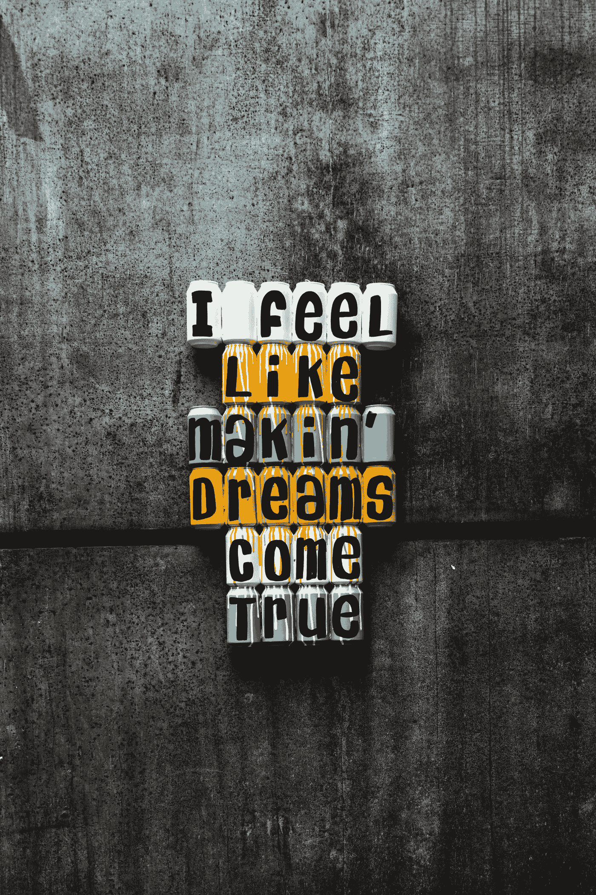

# 我放弃了一份足够好的职业，换来了一份好工作的机会

> 原文：<https://medium.com/swlh/im-trading-in-a-good-enough-career-for-the-chance-at-a-great-one-bfb6d51f99fb>

## 最终决定冒险投资自己

Photo by [Peter Fogden](https://unsplash.com/@petefogden?utm_source=unsplash&utm_medium=referral&utm_content=creditCopyText) on [Unsplash](https://unsplash.com/search/photos/quote?utm_source=unsplash&utm_medium=referral&utm_content=creditCopyText)

在我从洛杉矶短暂的假期回来后，我无法摆脱想辞掉科技行业的工作，成为一名全职作家的渴望。从我的日常生活结构中走出来，让我更容易去思考其他的…