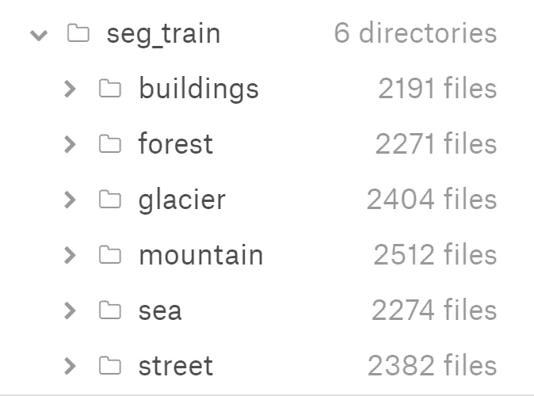
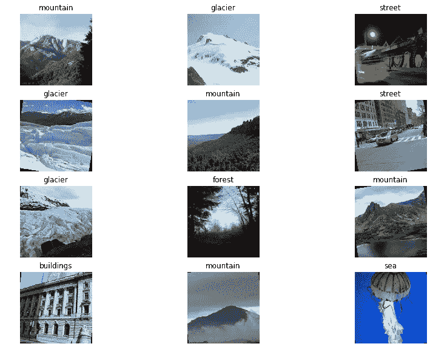
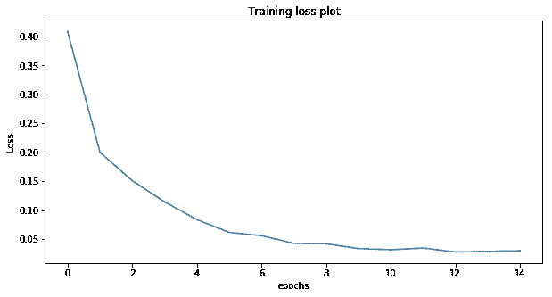
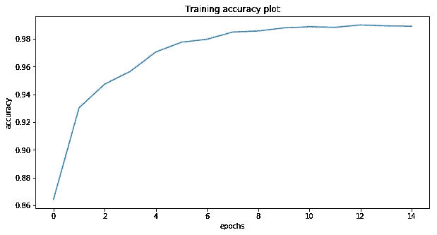
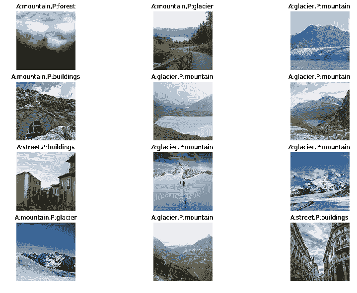
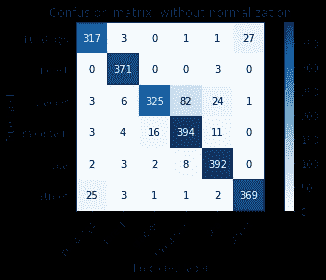
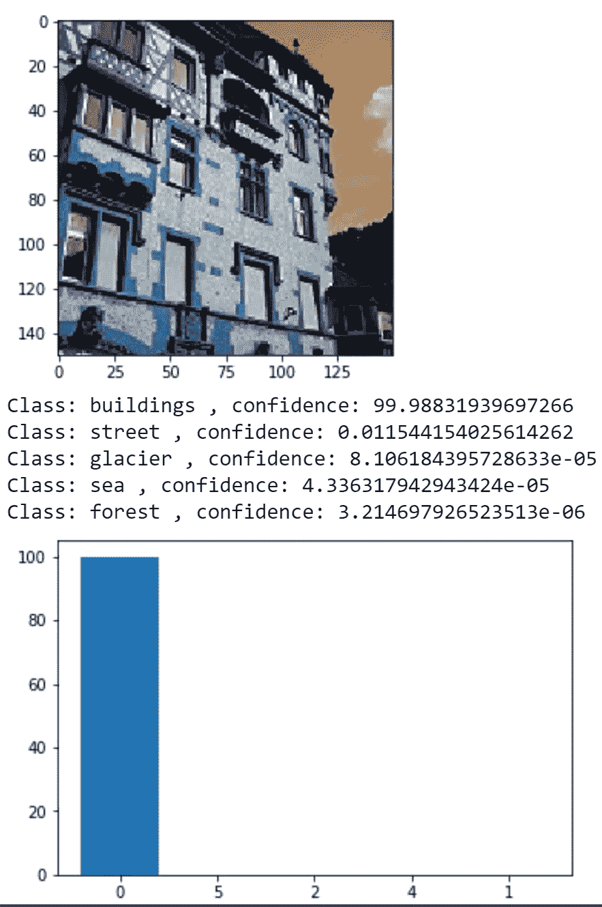

# pytorch 中的图像分类教程-迁移学习

> 原文：<https://medium.com/swlh/image-classification-tutorials-in-pytorch-transfer-learning-19ebc329e200>

报名参加我的计算机视觉直播课程:[https://bit.ly/cv_coursem](https://bit.ly/cv_coursem)

图像分类是机器学习/深度学习的任务，其中我们基于特定类别的人类标记数据对图像进行分类。我们将卷积神经网络用于图像数据，pytorch 的 torchvision 框架中内置了各种良好的预训练架构。我们将使用最近发布的[高效网](https://arxiv.org/abs/1905.11946)，因为它给出了最好的精确度。这里给出了它在 pytorch 中的实现[。我将尝试用数据分析、误差图、混淆矩阵等来完成这篇文章。本文的 Github 库是这里的](https://github.com/lukemelas/EfficientNet-PyTorch)。我们将使用 [kaggle](https://www.kaggle.com/puneet6060/intel-image-classification) 上提供的英特尔场景分类数据。此处链接笔记本[。](https://colab.research.google.com/github/sanchit2843/MLBasics/blob/master/IntelClassificationKaggle/Pytorch%20transfer%20learning%20tutorial%20%5B93%25acc%5D.ipynb)

# 数据加载器

在图像数据中，数据足够大，我们无法在内存中加载完整的数据，因此我们需要制作 dataloader，它将在我们传递数据时加载图像，并且只在内存中加载少量图像(内存中加载的图像数量是批量大小)。要制作数据加载器，我们要么需要将我们的图像划分到数据集中每个类的文件夹中，要么如果我们有所有图像的名称及其相应的标签，那么我们需要制作一个自定义数据集类，然后制作一个数据加载器。我们的数据集已经存在于不同的文件夹中，所以我使用了第一种方法。要查看第二种方法的示例，请单击[此处](https://pytorch.org/tutorials/beginner/data_loading_tutorial.html)，上面链接中的“FaceLandmarksDataset”类是自定义数据集类。有关基本解释，请参见代码中的注释。数据集文件夹包含每个类的 6 个子文件夹。我还将测试数据分为有效和测试两部分。



```
#We need to pass path to folder containing folders of classestrain_data = torchvision.datasets.ImageFolder(root = '../input/seg_train/seg_train', transform = train_transforms)test_data = torchvision.datasets.ImageFolder(root = '../input/seg_test/seg_test', transform = test_transforms)def data_loader(train_data,test_data = None , valid_size = None , batch_size = 32):
    train_loader =  DataLoader(train_data, batch_size = batch_size , shuffle = True)
    if(test_data == None and valid_size == None):
        dataloaders = {'train':train_loader}
        return dataloaders
    if(test_data == None and valid_size!=None):
        data_len = len(train_data)
        indices = list(range(data_len))
        np.random.shuffle(indices)
        split1 = int(np.floor(valid_size * data_len))
        valid_idx , test_idx = indices[:split1], indices[split1:]
        valid_sampler = SubsetRandomSampler(valid_idx)
        valid_loader = DataLoader(train_data, batch_size= batch_size, sampler=valid_sampler)
        dataloaders = {'train':train_loader,'val':valid_loader}
        return dataloaders
    if(test_data != None and valid_size!=None):
        data_len = len(test_data)
        indices = list(range(data_len))
        np.random.shuffle(indices)
        split1 = int(np.floor(valid_size * data_len))
        valid_idx , test_idx = indices[:split1], indices[split1:]
        valid_sampler = SubsetRandomSampler(valid_idx)
        test_sampler = SubsetRandomSampler(test_idx)
        valid_loader = DataLoader(test_data, batch_size= batch_size, sampler=valid_sampler)
        test_loader = DataLoader(test_data, batch_size= batch_size, sampler=test_sampler)
        dataloaders = {'train':train_loader,'val':valid_loader,'test':test_loader}
        return dataloaders
```

这里，函数 data_loader 将把 train_data、test_data 作为输入。我们还可以使用 valid_size 创建一个验证分割。它将返回一个包含所有已定义的数据加载器的字典。它可以用作

```
dataloaders = data_loader(train_data,test_data , valid_size = 0.2 , batch_size = batch_size)
```

我们还定义了 train_transforms。这是您想要在数据集上应用的数据扩充技术的列表。如果你不想要任何数据增强，它可以包含调整图像大小的功能，并将其转换为 pytorch 张量，我们需要在输入到神经网络之前。使用图像增强最有益，因此我将其声明为:

```
im_size = 150
train_transforms = transforms.Compose([
                            transforms.Resize((im_size,im_size)),
        transforms.RandomResizedCrop(size=315, scale=(0.95, 1.0)),                                   transforms.RandomRotation(degrees=10),                                   transforms.RandomHorizontalFlip(),
transforms.CenterCrop(size=299), # Image net standards
transforms.ToTensor(),                                        transforms.Normalize((0.4302, 0.4575, 0.4539), (0.2361, 0.2347, 0.2432))])
```

输入归一化函数(*转换)的平均值和标准偏差。Normalize((0.4302，0.4575，0.4539)，(0.2361，0.2347，0.2432))]* ))也可以设置为 0.5 但最好是求数据集的均值和标准差。可以使用以下公式为您的自定义数据集计算该值:

```
mean = 0.
std = 0.
nb_samples = len(data)
for data,_ in dataloader:
    batch_samples = data.size(0)
    data = data.view(batch_samples, data.size(1), -1)
    mean += data.mean(2).sum(0)
    std += data.std(2).sum(0)
mean /= nb_samples
std /= nb_samples
```

# 数据分析

我们需要用这些特定的类来可视化数据集，这段代码将有助于可视化这些类。我们可以获得数据集类名称，如下所示:

```
classes = train_data.classes
```

通过对类进行编码和解码，我们可以很容易地找到标签。

```
#encoder and decoder to convert classes into integer
decoder = {}
for i in range(len(classes)):
    decoder[classes[i]] = i
encoder = {}
for i in range(len(classes)):
    encoder[i] = classes[i]
```

这段代码将可视化 n_figures 数字与有特定的类。

```
import matplotlib.pyplot as plt
import random
#plotting rondom images from dataset
def class_plot( data , encoder ,inv_normalizen_figures = 12):
    n_row = int(n_figures/3)
    fig,axes = plt.subplots(figsize=(14, 10), nrows = n_row, ncols=3)
    for ax in axes.flatten():
        a = random.randint(0,len(data))
        (image,label) = data[a]
        label = int(label)
        l = encoder[label]
        image = inv_normalize(image)
        image = image.numpy().transpose(1,2,0)
        im = ax.imshow(image)
        ax.set_title(l)
        ax.axis('off')
    plt.show()
class_plot(train_data,encoder,inv_normalize)
```



这里我们使用了 inv_normalize。它在我们已经标准化原始图像的情况下使用。在可视化之前，我们需要对图像进行逆归一化。我们可以使用相同的 transform.normalize()来定义 inv_normalize。平均值和标准偏差的值将改变为:

```
inv_normalize =  transforms.Normalize(
    mean=[-0.4302/0.2361, -0.4575/0.2347, -0.4539/0.2432],
    std=[1/0.2361, 1/0.2347, 1/0.2432]
)
```

# 模型

如前所述，我使用了高效网络。如果您想使用 pytorch 中给出的模型，只需将第 4 行替换为

```
self.resnet = models.resnet34(pretrained = **True**)
```

这将使该型号成为 resnet34，pytorch 中的其他型号可以在[这里](https://pytorch.org/docs/stable/torchvision/models.html.)看到。

这里我们创建了一个自定义的神经网络类。

对于分类，我们使用交叉熵损失。我们也可以使用负对数似然损失，但我们需要神经网络的输出是 log softmax。

# 培养

为了找到学习率，我使用了快速人工智能课程中建议的学习率计划程序。对于 pytorch，我使用了在 [GitHub](https://github.com/davidtvs/pytorch-lr-finder) 上可用的实现。

```
from lr_finder import LRFinder
optimizer_ft = optim.Adam(classifier.parameters(), lr=0.0000001)
lr_finder = LRFinder(classifier, optimizer_ft, criterion, device=device)
lr_finder.range_test(train_loader, end_lr=1, num_iter=500)
lr_finder.reset()
lr_finder.plot()
```

这将为我们提供损失-时期图，并且我们可以找到模型将继续更快收敛的最大学习速率。为了减少过度拟合，我还使用了早期停止，这在 [GitHub](https://github.com/Bjarten/early-stopping-pytorch) 上的 pytorch 中可用。提前停止将基于验证损失停止模型。



# 测试和性能指标:

为了检查模型的性能，我们需要从数据的测试分割中获得预测。下面的函数将把 testloader 和 modelas 作为一个参数，并将返回错误预测的预测标签、真实标签、真实和预测标签以及错误预测的图像列表。创建的错误预测列表将帮助我们绘制带有错误预测的图像。

```
batch_size = 8
sm = nn.Softmax(dim = 1)
def test(model,dataloader):
    running_corrects = 0
    running_loss=0
    pred = []
    true = []
    pred_wrong = []
    true_wrong = []
    image = []

    for batch_idx, (data, target) in enumerate(dataloader):
        data, target = Variable(data), Variable(target)
        data = data.type(torch.cuda.FloatTensor)
        target = target.type(torch.cuda.LongTensor)
        model.eval()
        output = model(data)
        loss = criterion(output, target)
        output = sm(output)
        _, preds = torch.max(output, 1)
        running_corrects = running_corrects + torch.sum(preds == target.data)
        running_loss += loss.item() * data.size(0)
        preds = preds.cpu().numpy()
        target = target.cpu().numpy()
        preds = np.reshape(preds,(len(preds),1))
        target = np.reshape(target,(len(preds),1))
        data = data.cpu().numpy()

        for i in range(len(preds)):
            pred.append(preds[i])
            true.append(target[i])
            if(preds[i]!=target[i]):
                pred_wrong.append(preds[i])
                true_wrong.append(target[i])
                image.append(data[i])

    epoch_acc = running_corrects.double()/(len(dataloader)*batch_size)
    epoch_loss = running_loss/(len(dataloader)*batch_size)
    print(epoch_acc,epoch_loss)
    return true,pred,image,true_wrong,pred_wrong
```

现在，我们可以使用代码绘制带有错误预测的图像。它将把上述函数返回的 true _ wrong、pred _ wrong 和 image 作为输入。它还将采用上面定义的 inv_normalize。

```
def wrong_plot(true,ima,pred,encoder,inv_normalize,n_figures = 12):
    print('Classes in order Actual and Predicted')
    n_row = int(n_figures/3)
    fig,axes = plt.subplots(figsize=(14, 10), nrows = n_row, ncols=3)
    for ax in axes.flatten():
        a = random.randint(0,len(true)-1)

        image,correct,wrong = ima[a],true[a],pred[a]
        image = torch.from_numpy(image)
        correct = int(correct)
        c = encoder[correct]
        wrong = int(wrong)
        w = encoder[wrong]
        f = 'A:'+c + ',' +'P:'+w
        if inv_normalize !=None:
            image = inv_normalize(image)
        image = image.numpy().transpose(1,2,0)
        im = ax.imshow(image)
        ax.set_title(f)
        ax.axis('off')
    plt.show()
```



wrong predictions

现在，我们将使用各种性能指标来检查模型的性能，如准确性、f1 分数、精确度和召回率。我们还将绘制预测的混淆矩阵。

```
def performance_matrix(true,pred):
    precision = metrics.precision_score(true,pred,average='macro')
    recall = metrics.recall_score(true,pred,average='macro')
    accuracy = metrics.accuracy_score(true,pred)
    f1_score = metrics.f1_score(true,pred,average='macro')
    print('Confusion Matrix:\n',metrics.confusion_matrix(true, pred))
    print('Precision: {} Recall: {}, Accuracy: {}: ,f1_score: {}'.format(precision*100,recall*100,accuracy*100,f1_score*100))
```

结果:

准确率:90.78，召回率:90.68，准确率:90.33，f1_score: 90.44

混淆矩阵:



要绘制这种类型的图像，请使用以下代码:

```
def plot_confusion_matrix(y_true, y_pred, classes,
                          normalize=False,
                          title=None,
                          cmap=plt.cm.Blues):
    """
    This function prints and plots the confusion matrix.
    Normalization can be applied by setting `normalize=True`.
    """
    if not title:
        if normalize:
            title = 'Normalized confusion matrix'
        else:
            title = 'Confusion matrix, without normalization'# Compute confusion matrix
    cm = metrics.confusion_matrix(y_true, y_pred)
    # Only use the labels that appear in the data
    #classes = classes[unique_labels(y_true, y_pred)]
    if normalize:
        cm = cm.astype('float') / cm.sum(axis=1)[:, np.newaxis]
        print("Normalized confusion matrix")
    else:
        print('Confusion matrix, without normalization')print(cm)fig, ax = plt.subplots()
    im = ax.imshow(cm, interpolation='nearest', cmap=cmap)
    ax.figure.colorbar(im, ax=ax)
    # We want to show all ticks...
    ax.set(xticks=np.arange(cm.shape[1]),
           yticks=np.arange(cm.shape[0]),
           # ... and label them with the respective list entries
           xticklabels=classes, yticklabels=classes,
           title=title,
           ylabel='True label',
           xlabel='Predicted label')# Rotate the tick labels and set their alignment.
    plt.setp(ax.get_xticklabels(), rotation=45, ha="right",
             rotation_mode="anchor")# Loop over data dimensions and create text annotations.
    fmt = '.2f' if normalize else 'd'
    thresh = cm.max() / 2.
    for i in range(cm.shape[0]):
        for j in range(cm.shape[1]):
            ax.text(j, i, format(cm[i, j], fmt),
                    ha="center", va="center",
                    color="white" if cm[i, j] > thresh else "black")
    fig.tight_layout()
    return ax
plot_confusion_matrix(true, pred, classes= classes,title='Confusion matrix, without normalization')
```

该函数将真实标签和预测标签作为输入。它还将接受类名作为输入。

**预测:**

现在，可以作为应用程序部署的最终分类模型应该对单个图像进行预测，并给出最高预测类别的置信度得分。

```
def predict(model,image,device,encoder,transforms = None,inv_normalize = None):
    #model = torch.load('./model.h5')
    model.eval()
    if(isinstance(image,np.ndarray)):
      image = Image.fromarray(image)
    if(transforms!=None):
        image = transforms(image)
    data = image.expand(1,-1,-1,-1)
    data = data.type(torch.FloatTensor).to(device)
    sm = nn.Softmax(dim = 1)
    output = model(data)
    output = sm(output)
    _, preds = torch.max(output, 1)
    img_plot(image,inv_normalize)
    prediction_bar(output,encoder)
    return preds
```

这个函数将获取运行系统的设备(CPU 或 GPU)的映像。之前定义的编码器、测试转换和 inv_normalize。它将给出前 5 个类的置信度得分，并绘制置信度得分的条形图。使用的 img_plot 和预测条函数定义如下:

```
def prediction_bar(output,encoder):
    output = output.cpu().detach().numpy()
    a = output.argsort()
    a = a[0]

    size = len(a)
    if(size>5):
        a = np.flip(a[-5:])
    else:
        a = np.flip(a[-1*size:])
    prediction = list()
    clas = list()
    for i in a:
      prediction.append(float(output[:,i]*100))
      clas.append(str(i))
    for i in a:
        print('Class: {} , confidence: {}'.format(encoder[int(i)],float(output[:,i]*100)))
    plt.bar(clas,prediction)def img_plot(image,inv_normalize = None):
    if(inv_normalize!=None):
        image = inv_normalize(image)
    image = image.cpu().numpy().transpose(1,2,0)
    plt.imshow(image)
    plt.show()
```



如果你遇到错误，请查看 google colab 上的笔记本，并尝试执行代码。

感谢您阅读完整的博客。如果我做错了什么，请批评。