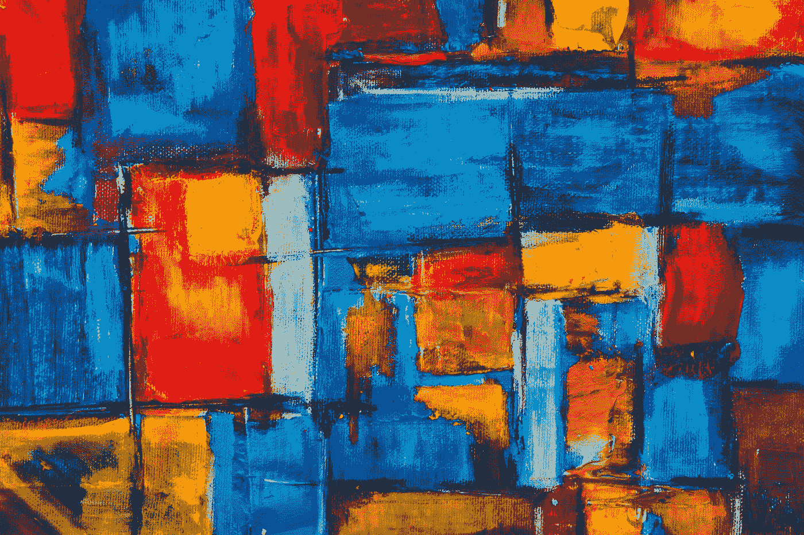
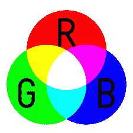
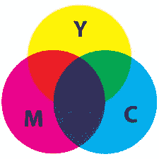
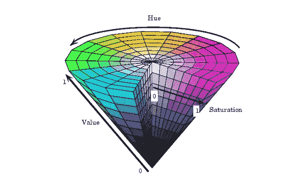
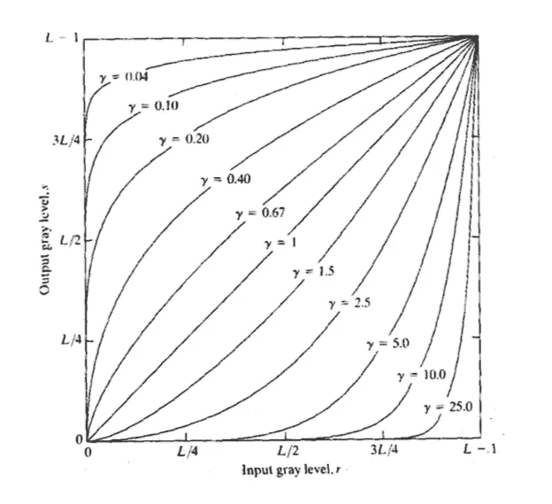

# 使用 Matlab/Octave 进行图像处理—第二部分

> 原文：<https://medium.com/swlh/image-processing-using-matlab-octave-part-2-218627067a5d>



Photo by [Steve Johnson](https://unsplash.com/photos/LOnPLLM4rpQ?utm_source=unsplash&utm_medium=referral&utm_content=creditCopyText) on [Unsplash](https://unsplash.com/search/photos/art?utm_source=unsplash&utm_medium=referral&utm_content=creditCopyText)

> 在前一部分中，我们看到了什么是图像处理，它是如何工作的，以及 Matlab/Octave 的一些基础知识。在这一部分，我们将看到颜色模型，Matlab/Octave 中的一些附加函数，以及如何进行基本的图像增强。

# 什么是颜色模型？

颜色模型是一种将颜色表示为元组中三个或四个数字的组合的数学方法。

让我们看一些彩色模型。

**RGB(红绿蓝)**



RGB Color Model

这是一个加色模型，你可以看到所有原色红、绿、蓝的混合产生白色，你还可以看到青色、品红色和黄色。

**CMY(青色品红黄色)**



CMY Color Model

在这里，将这三种物质混合在一起就成了黑色。这种模式在印刷中广泛使用，但由于这种黑色不是纯黑色，所以添加了 K(Key)来完成 CMYK，其中 K 代表黑色。

另一个颜色模型 **HSV(色调饱和度值)**也被使用。



[Source](http://gagauznews.md/22463/dualizm-fundamentalnoe-svojstvo-nashego-mira-ili-razvodka.html)

在这里，你可以看到圆锥越靠近底部，颜色越深(值)，在圆锥的边缘颜色最亮(饱和度)，在圆周上你可以看到不同的颜色(色调)。

# Matlab/Octave 中的附加函数

首先，我们将了解如何在 Matlab 中读取/写入图像并显示它们。

**读数**:

```
 img = imread(“lena.png”);
```

**写作**:

```
 imwrite(img, “Lena.png”);
```

**显示**:

```
 imshow(img); 
```

**图像转换**

为了在图像之间进行转换，Matlab 中有内置函数，例如:

**RGB →灰色:**

```
 gray_image = rgb2gray(rgb_image);
```

**RGB→二进制:**

```
 binary = im2bw(rgb_image);
```

**RGB → HSV:**

```
 hsv_image = rgb2hsv(rgb_image);
```

# 图像增强

增强的目的是处理图像，使得结果比原始图像更适合特定的应用。图像增强方法分为两大类:空间域和频率域。

在空间域中，直接在图像的像素上进行图像操作。它可以表示为:

```
 G(x, y) = T[F(x, y)]
```

其中，(x，y)是像素的坐标，F 是输入图像，G 是增强图像，T 是 F 上的算子。

现在让我们看看这些运算符:

1.  **图像阴性**

图像的负片就是从 255 的灰度图像中减去像素值。它的形式如下:

```
 N = (L - 1) - I
```

其中，L-1 = 255，用于灰度图像，I 是图像像素。

现在让我们在 Matlab 中实现它:

```
clear all; % clear all variables
close all; % close all figures
clc;       % clear command window% import image package
pkg load image;% read image
img = imread(“lena.png”);% convert image into gray and then from uint8 to double
grayscale_img = rgb2gray(img);% show grayscale image
figure
imshow(grayscale_img);
title(“grayscale image”);
imwrite(grayscale_img, “original.jpg”);# calculate negative of the image
output = 255 — grayscale_img;% show output image
figure
imshow(uint8(output));
title(“output image”);
imwrite(uint8(output), “negative_tansformation.jpg”);
```

前 3 行清除内存中的变量，关闭所有打开的窗口，并清空终端。

然后，我们导入图像包。如果你不知道如何做到这一点，去[这里](https://octave.sourceforge.io/image/index.html)并且下载这个包并且跟随这个[教程](https://octave.org/doc/v4.2.1/Installing-and-Removing-Packages.html)。

现在图像被读取并转换成灰度。在这之后，一个新的窗口被创建，图像显示为标题“灰度图像”并被写入“原始. jpg”。

*“输出”*是输入图像的负片，进行同样的显示和写入。

**2。日志转换:**

这是通过以下操作完成的:

```
 s = c log(1+r)
```

其中 c 是常数。

它扩展了暗像素的值(接近 0)并压缩了较高等级的值(接近 255)，即压缩了图像的[动态范围](https://en.wikipedia.org/wiki/Dynamic_range)，图像看起来褪色了。

代码:

```
c = 45;
output = c * log(1 + grayscale_img);
```

**3。幂律变换**

它也被称为伽马校正。它的基本形式是:

```
 s = c * r^𝛄
```

其中 c 和𝛄是常数，r 是输入图像。



这是一个 s 对𝛄的曲线图，其中𝛄 < 1 results in dark values and 𝛄 > 1 产生了明亮的值。

代码:

```
r = double(img)/255;
c = 1;
gamma = 0.6;
s = c * (r) .^ gamma;
```

**4。对比度拉伸**

对比度是图像“范围”的量度；即它的强度有多分散。

```
 Contrast = ( Imax — Imin ) / ( Imax + Imin )
```

它将图像中的最小强度映射到范围(0–100)中的最小值，将图像中的最大强度映射到最大值(200–255)。对比度拉伸就是增加图像中最大强度值和最小强度值之间的差异。所有剩余的强度值都分布在这个范围内。

代码:

使用 *imadjust* 只用一行代码就可以完成。

```
cs = imadjust(gray_img, stretchlim(gray_img),[]);
```

或者用下面的公式:

```
a      = min(img(:));            %minimum pixel of image X
b      = max(img(:));            %maximum pixel of image X 
cs_img = (img - a) .* (255 / (b - a));
```

接下来，我们将看到使用 MATLAB/Octave 的图像滤波。

请点击👏按钮，如果你喜欢这个帖子，拿着它给更多的爱。

如果您希望连接:

[**Github**](https://github.com/adesgautam)**[**LinkedIn**](https://www.linkedin.com/in/adesh-gautam-518810127/)**[**Twitter**](https://twitter.com/gautamades)**[**insta gram**](https://www.instagram.com/adeshgautam/)******

****[](https://medium.com/swlh)****

## ****这篇文章发表在 [The Startup](https://medium.com/swlh) 上，这是 Medium 最大的创业刊物，拥有+442，678 读者。****

## ****在这里订阅接收[我们的头条新闻](https://growthsupply.com/the-startup-newsletter/)。****

****[](https://medium.com/swlh)****