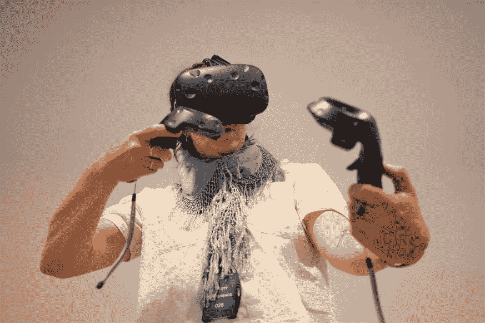

# 沉浸式和模拟现实对社会有益

> 原文：<https://medium.com/swlh/immersive-and-simulated-reality-for-social-good-36ea918fdc13>

## 科技换好系列

A student tries virtual reality, Copenhagen Institute for Interactive Design Summer School, Copenhagen

## 沉浸式现实

沉浸式技术将你带入一种体验。研究表明，在这些环境中的强有力的故事被我们的大脑储存为记忆——带有记忆捕捉到的全部情感。在某种程度上，这些经历可以成为增加同理心、同情心和行为改变的途径…