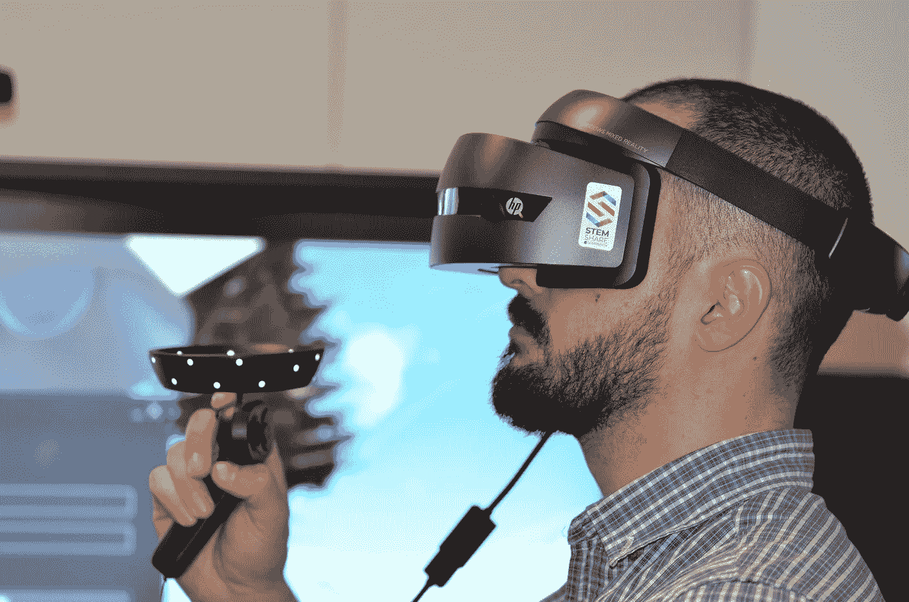

# 沉浸式讲故事的未来

> 原文：<https://medium.com/swlh/immersive-storytellings-future-de72ccd145ff>

Photo by [Laurens Derks](https://unsplash.com/@flderks?utm_source=unsplash&utm_medium=referral&utm_content=creditCopyText) on [Unsplash](https://unsplash.com/search/photos/immersive-storytelling?utm_source=unsplash&utm_medium=referral&utm_content=creditCopyText)

> 叙事想象——故事——是思维的基本工具。理性能力取决于此。它是我们展望未来或预测、计划和解释的主要手段。——[*马克特纳*](http://markturner.org/)
> 
> 我们不会用故事来逃避现实。我们依靠故事来驾驭现实。—丽莎·克朗， **故事天才** *(2016)*

讲故事的未来是沉浸式的。讲故事的现在和过去也已经倾向于沉浸式——如果我们要对自己完全诚实的话。那么，是什么让我们如此确定沉浸感是未来讲故事的关键呢？

为了解决我上面谈到的问题，我需要首先回答以下问题:沉浸式讲故事到底是什么意思？这是一个很难解决的问题，也是我现在想讨论的问题。为了处理像*沉浸*这样模糊或复杂的事情，一个人需要查阅字典并建立在那个定义的基础上，以便做任何有建设性的事情。

《牛津英语词典》对这个棘手的单词 immersion 提供了一些见解:

> 浸入或沉浸的动作。

如果我们更深入地研究牛津英语词典，我们会发现以下关于沉浸本质的启示:

> ***传递性:*** 将液体浸入、投入、放在表面下；沉浸其中。
> 
> ***转移和比喻:*** 投入一种行动或思想、生活方式等的状态。

如果我们采用《牛津英语词典》的定义并以此为基础，我们会发现沉浸感是讲故事领域的一种常规体验，尤其是现在。事实上，对多种形式的讲故事的恐惧之一是它模糊了*现实*和*虚构*之间的界限。早期对“默读”的恐惧之一是，它让一个人呆在自己的脑袋里，在自己的想象中嬉戏，而不受那些理应知道得更多的人的约束。同样的恐惧也被贴在了视频游戏、角色扮演游戏(想想:*地下城&龙*)甚至某些形式的音乐上。想象被认为是危险的，一次又一次，我们发现关于想象的危险和假定的逃离现实的信息。例如，在*星际迷航*系列中对全息甲板的反复探索表明，关于讲故事的沉浸性的焦虑在我们今天的社会中仍然普遍存在(并且在未来也将继续处于前沿)。然而，如果我们对自己诚实，沉浸感一直是讲故事的关键。

Lisa Cron 在讲故事方面的工作表明，故事的本质确实已经根植于人类的大脑。各种形式的身临其境的讲故事，一直是人类的独特之处。讲故事是我们区别于其他在这个星球上生存的动物的地方。此外，如果我们看看人类的宗教和历史著作，讲故事在传承神的知识或使过去的英雄永垂不朽方面发挥着重要作用。讲故事需要有能力走出自己的头骨王国，走出自己的环境，并旅行到未来，进入另一个领域，或进入他人的生活。从根本上讲，讲故事需要某种形式的沉浸感。

为什么未来的故事会比我们现在的故事更令人身临其境？

讲故事的未来是挑战模糊现实和虚构的极限。换句话说，未来的故事将挑战我们对沉浸的概念，以及沉浸在一个人的想象中意味着什么。虚拟和增强现实的出现已经促使未来学家和故事讲述者重新考虑我们与讲故事的关系。

未来的讲故事不一定要抛弃过去的技巧、比喻和来之不易的教训。相反，讲故事的未来可能会站在过去的故事讲述者的肩膀上，推动我们超越我们目前正在进行的实验。讲故事的未来是沉浸在我们今天无法理解的水平上，即使有我们的电视节目和全息甲板。未来讲故事的沉浸式能力将超过我们现在可以想象或做的任何事情。说到这里，我们不禁要问，我们现在能做什么？

讲故事的未来需要现在的推动。我们需要超越传统的讲故事模式。此外，我们需要建立远比我们现在看到的更加身临其境的讲故事体验。我们如何做到这一点？这就是事情变得复杂的地方，因为我们透过我们现在掌握的模糊镜头来看。

讲故事的未来将是沉浸感自然或近乎自然的。未来讲故事的沉浸性质将不会建立单一框架的场景，而是依赖于开发丰富的世界或宇宙，可以与参与者互动和探索。换句话说，完全沉浸将需要代表参与者的大量*代理*。这种新的代理感可以由像人工智能这样的强大软件来引导，充当解说员、游戏管理员或两者兼而有之。此外，未来讲故事的沉浸感将超越单一媒介。消费者将能够观看电影、电视节目，探索 wikis、博客或 vlogs，增加他们对他们最喜欢的讲故事的世界/世界的知识、理解和体验。

未来的特许经营，如果他们是明智的，将很乐意支持他们的世界/宇宙的粉丝的这种跨媒体探索。我们已经看到了这方面的早期例子，如《T2》《星球大战》《T4》《星际迷航》《T5》，甚至是昙花一现的《挑战宇宙》。然而，创作者可以比现在更多地鼓励和促进跨媒体探索。为了帮助粉丝参与他们最喜欢的世界或宇宙，创作者可以鼓励粉丝小说、世界建设项目和粉丝创作的产品使用开源和廉价的许可，让粉丝成为他们最喜欢的特许经营的共同利益相关者。换句话说，创作者可以做的不仅仅是创作故事。他们可能正在创造身临其境的体验，这对于粉丝来说是如此的诱人，以至于他们拒绝离开他们最喜欢的世界或宇宙。这意味着一个讲故事的宇宙或世界的广阔性将是它最大的财富。

回到我最初的问题:是什么让我们如此确定沉浸感是讲故事的未来的关键？沉浸感是所有讲故事的关键——过去、现在和未来。如果没有讲故事的沉浸式能力，它就没有吸引读者/参与者的力量。完全沉浸在一个讲故事的宇宙或世界中需要的不仅仅是一个简单的故事。它需要多个故事、一个故事场景和参与者代理。这些东西现在已经有了；然而，如果我们要实现讲故事的未来，我们需要将这些东西整合成一个更紧密的包，提供给参与者/读者。

**更多 G. Michael Rapp 的作品，请考虑** [**访问他在 Medium**](/@gregorymrapp) **上的简介。**