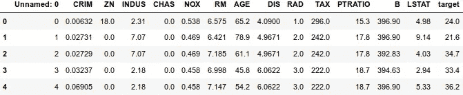
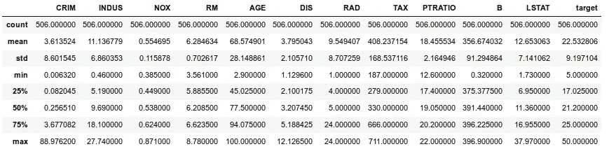
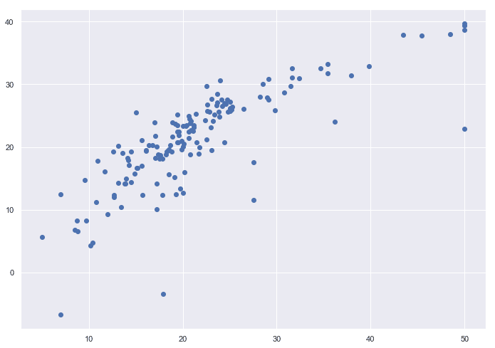

# 线性回归的实现📈

> 原文：<https://medium.com/swlh/implementation-of-linear-regression-9fd58cb4656c>

## 循序渐进的方法


我们将对' **Boston Housing** '数据集实施线性回归。

波士顿数据集包含波士顿不同房屋的信息。该数据集中有 506 个样本和 13 个特征变量。我们的目标是**使用给定的特征**预测房子的价格。

## **导入必要的库**

```
import numpy as np
import pandas as pd
import matplotlib.pyplot as plt
```

## **将数据集加载到数据框中**

```
data = pd.read_csv("boston.csv")
```

获取关于波士顿住房数据集的基本细节，如空值或缺失值、数据类型等。我们可以用**。info()** 如下所示:

```
data.info()<class 'pandas.core.frame.DataFrame'>
RangeIndex: 506 entries, 0 to 505
Data columns (total 15 columns):
Unnamed: 0    506 non-null int64
CRIM          506 non-null float64
ZN            506 non-null float64
INDUS         506 non-null float64
CHAS          506 non-null float64
NOX           506 non-null float64
RM            506 non-null float64
AGE           506 non-null float64
DIS           506 non-null float64
RAD           506 non-null float64
TAX           506 non-null float64
PTRATIO       506 non-null float64
B             506 non-null float64
LSTAT         506 non-null float64
target        506 non-null float64
dtypes: float64(14), int64(1)
memory usage: 59.4 KB
```

## 处理数据框中的缺失值

**当使用。head()方法:**

```
data.head()
```



通常， **NaN 或缺失值**可以是任何形式，如 **0、？或者可以写成" missing"** 在我们的例子中，我们可以看到有很多 0，所以我们可以用 NaN 代替它们来计算我们丢失了多少数据。

```
data.ZN.replace(0, np.nan, inplace = True)
data.CHAS.replace(0, np.nan, inplace = True)
```

使用**更换后。info()** 方法查看数据集中缺失值的详细信息:

```
data.info()<class 'pandas.core.frame.DataFrame'>
RangeIndex: 506 entries, 0 to 505
Data columns (total 15 columns):
Unnamed: 0    506 non-null int64
CRIM          506 non-null float64
ZN            134 non-null float64
INDUS         506 non-null float64
CHAS          35 non-null float64
NOX           506 non-null float64
RM            506 non-null float64
AGE           506 non-null float64
DIS           506 non-null float64
RAD           506 non-null float64
TAX           506 non-null float64
PTRATIO       506 non-null float64
B             506 non-null float64
LSTAT         506 non-null float64
target        506 non-null float64
dtypes: float64(14), int64(1)
memory usage: 59.4 KB
```

计算数据集中缺失值的**百分比。一般来说，如果有 20-25%的缺失值，我们可以用不同的方法来估算，如均值或中值。**

但是如果不止如此，最好移除这些特征，否则它们会影响我们的结果。正如我们在下面看到的，**【ZN】**和**【CHAS】**都丢失了超过 70%的数据，因此我们将删除这两个特征。

```
data.isnull().sum() / len(data) * 100
Unnamed: 0     0.000000
CRIM           0.000000
ZN            73.517787
INDUS          0.000000
CHAS          93.083004
NOX            0.000000
RM             0.000000
AGE            0.000000
DIS            0.000000
RAD            0.000000
TAX            0.000000
PTRATIO        0.000000
B              0.000000
LSTAT          0.000000
target         0.000000
dtype: float64
```

下降列**【ZN】****【CHAS】**以及**【未命名:0】**如下图所示:

```
data = data.drop(['ZN', 'CHAS', 'Unnamed: 0'], axis = 1)
```

现在，再次检查丢失数据的百分比，以确保一切正常，这样我们就可以继续工作，而不用担心丢失数据。

```
data.info()
<class 'pandas.core.frame.DataFrame'>
RangeIndex: 506 entries, 0 to 505
Data columns (total 12 columns):
CRIM       506 non-null float64
INDUS      506 non-null float64
NOX        506 non-null float64
RM         506 non-null float64
AGE        506 non-null float64
DIS        506 non-null float64
RAD        506 non-null float64
TAX        506 non-null float64
PTRATIO    506 non-null float64
B          506 non-null float64
LSTAT      506 non-null float64
target     506 non-null float64
dtypes: float64(12)
memory usage: 47.5 KB
```

进一步获得一些关于我们的数据，如平均值，中位数，计数等基本信息。，我们就用**。**描述()方法如下所示:

```
data.describe()
```



## **分离因变量和自变量**

```
X = data.iloc[:,:-1]
y = data.iloc[:,-1]
```

## **将数据分为训练集和测试集**

```
from sklearn.model_selection import train_test_split
X_train, X_test, y_train, y_test = train_test_split(X, y, test_size = 0.25, random_state = 0)
```

## **从 sklearn 导入线性回归类**

```
from sklearn.linear_model import LinearRegression
model = LinearRegression()
model.fit(X_train, y_train) # Fitting our model to the training set
```

## **现在用做预测。预测()方法**

```
y_pred = model.predict(X_test)
```

## **计算衡量模型性能的指标**

这里我们计算了**平均绝对误差(MAE)、均方误差(MSE)和均方根误差(RMSE)** 。我们还为我们的分类器计算了**分数**。

```
from sklearn import metrics 
print("MAE", metrics.mean_absolute_error(y_test, y_pred))
print("MSE", metrics.mean_squared_error(y_test, y_pred))
print("RMSE", np.sqrt(metrics.mean_squared_error(y_test, y_pred)))
print("Score:", model.score(X_test, y_test))MAE 3.773568493778742
MSE 31.332023490151126
RMSE 5.59750153998649
Score: 0.6164944788849184
```

让我们也在测试集和预测集上做一个散点图，在理想情况下应该沿着一条直线。

```
plt.scatter(y_pred, y_test)
plt.show()
```



这是一个很好的结果，但您永远不会以这种方式对波士顿住房数据集使用线性回归，我们通常会使用正则化来进一步约束模型系数。

好了，伙计们，你们已经学会了如何对“波士顿住房”数据集进行线性回归。现在，继续尝试在您选择的任何数据集上实现线性回归。