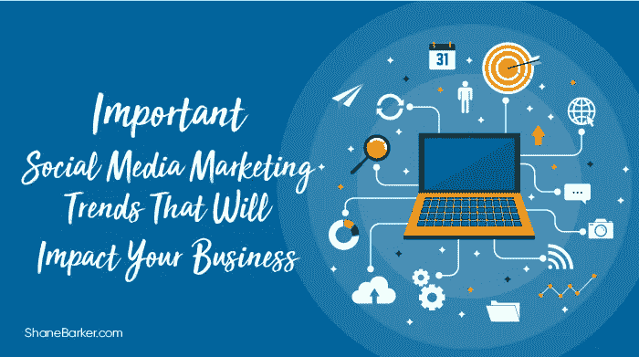

# 将影响您业务的重要社交媒体营销趋势

> 原文：<https://medium.com/swlh/important-social-media-marketing-trends-that-will-impact-your-business-d820bad9db1d>

根据[皮尤研究中心](https://www.pewresearch.org/)的数据，大约 68%的美国人使用脸书，73%使用 YouTube。随着时间的推移，社交媒体已经演变成一个伟大的营销工具。就像其他形式的营销一样，社交媒体的格局正在快速变化。这使得跟上最新的趋势对你来说很重要。