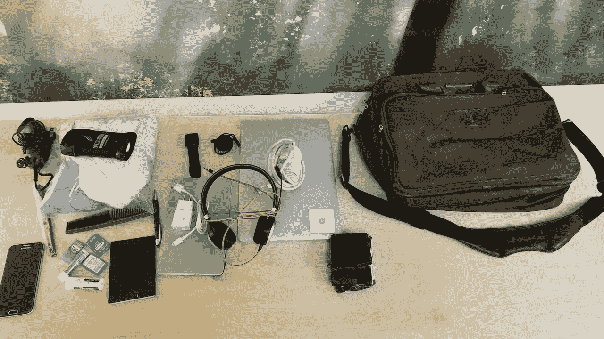

# 在 CES 旅行之前

> 原文：<https://medium.com/swlh/in-advance-of-the-ces-trek-abd2b189d3d9>

What I packed for CES last year

这将是许多年来(也许 5 年以上)我第一次不打算参加 CES。我很期待！

CES 有近 200，000 名与会者，数以千计的展品分布在多个场馆。我第一次去的时候，出租车排队等了一个多小时，尽管车程是 12 分钟。在会场从出租车里出来又等了 10 分钟。幸运的是，优步缩短了等待时间，从机场到比赛场地大概只需要 30 分钟。

当然，在主会场之间穿梭也可能是一种等待。从金沙博览中心到 LVCC 只有五分钟的车程，有一次我决定乘坐班车，从一个地方到另一个地方需要一个多小时。挨家挨户走 30 分钟左右是最靠谱的方式。在会议间隙，我看到了近 6 倍的优步激增。

随着时间的推移，我学会了如何为 CES 打包更轻的东西，并磨练日程安排。以下是一些经过提炼的知识:

去年，我在 36 个小时内安排了 30 次会议，我或另一方有 70%的时间都迟到了，导致下一次会议迟到。消费电子展的后续跟进也很困难。你等了几天，等所有人都回家了，然后会议上出现的任何东西都变得不那么令人兴奋了。

CES 上有一些擅长的东西:

*   与客户和合作伙伴建立联系。与人面对面交流不会被高估。它使他们人性化。
*   亲自观看演示。
*   观察其他人对产品的反应。
*   了解市场趋势。在推出第 50 款耳塞产品后，你开始意识到市场的需求。
*   在客户中建立新的关系网。

如果你真的要去，注意安全，补充水分，确保带上润唇膏……沙漠很干燥。

## 这篇文章发表在[《创业](https://medium.com/swlh)》上，这是 Medium 最大的创业刊物，有+406，714 人关注。

## 订阅接收[我们的头条新闻](http://growthsupply.com/the-startup-newsletter/)。

