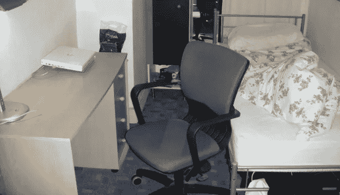

# 捍卫小住宅

> 原文：<https://medium.com/swlh/in-defence-of-small-dwellings-b460a8a88bdf>

居住在狭小的空间如何改善你的生活，并增加精神训练。

My old bedsit in London. Photo courtesy of Michele Koh Morollo

当我在伦敦上学时，我在一个 90 平方英尺(8.36 平方米)的小公寓里住了三年。这张床是一个烤肉店上面的多房间公寓的一部分，一个房东把它租给了包括我在内的七个学生房客。我的是所有单位中最小的。里面有一张金属框架的单人床，一张小桌子…