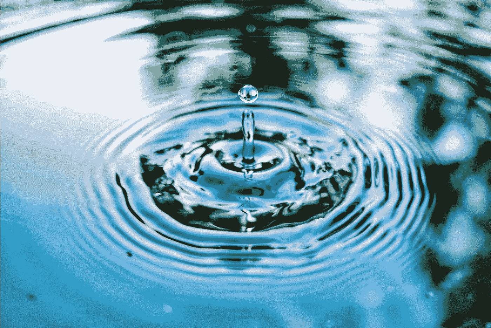

# 爱上涟漪&他们关于烦恼的人生教训

> 原文：<https://medium.com/swlh/in-love-with-ripples-their-life-lessons-about-worrying-577548955d90>

## 从水面学习

Photo by [Jimmy Chang](https://unsplash.com/@photohunter?utm_source=unsplash&utm_medium=referral&utm_content=creditCopyText)on [Unsplash](https://unsplash.com/search/photos/water-ripples-in-pond?utm_source=unsplash&utm_medium=referral&utm_content=creditCopyText)

最近，我写了[我的红色夹克](/@mapatrovani/the-story-of-the-shredded-red-jacket-4fbf763cf111)的故事，以及它如何在干扰、波动和稳定中提供教训。这些教训对生活和工作都很重要。

今天，当我坐在那里啜饮着早晨的咖啡时，外面潺潺的流水看着我，唱着轻柔的歌，向我的爱人示爱…