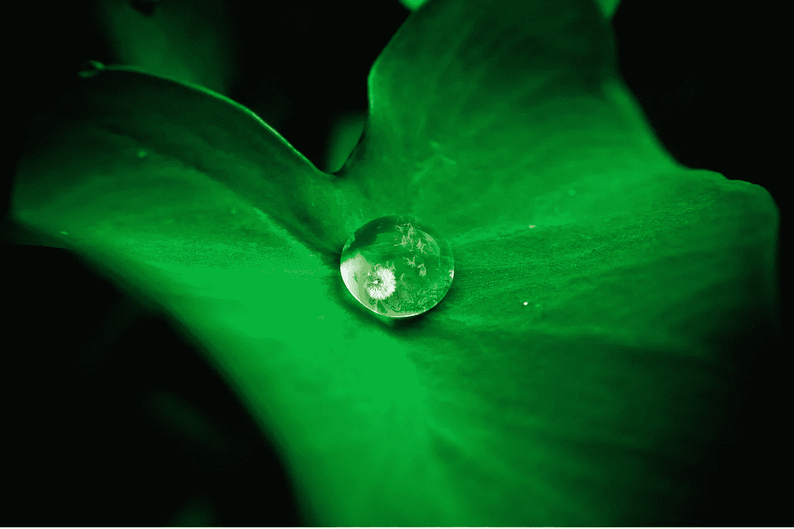

# 追求简单和意义

> 原文：<https://medium.com/swlh/in-pursuit-of-simplicity-and-meaning-3b667f31828>

简化日常生活并赋予其意义的 14 种方法

Photo by [贝莉儿 NG](https://unsplash.com/photos/C_-DQF-x-N0?utm_source=unsplash&utm_medium=referral&utm_content=creditCopyText) on [Unsplash](https://unsplash.com/search/photos/raindrops-on-leaves?utm_source=unsplash&utm_medium=referral&utm_content=creditCopyText)

几周前，我把我的媒体简介更新为“追求简单和意义”

大约在同一时间，我有一段时间个人和职业生活负荷过重，有一天，在工作中我记不起同事的名字。在注意到一次会议中有三次我无法找回我的…