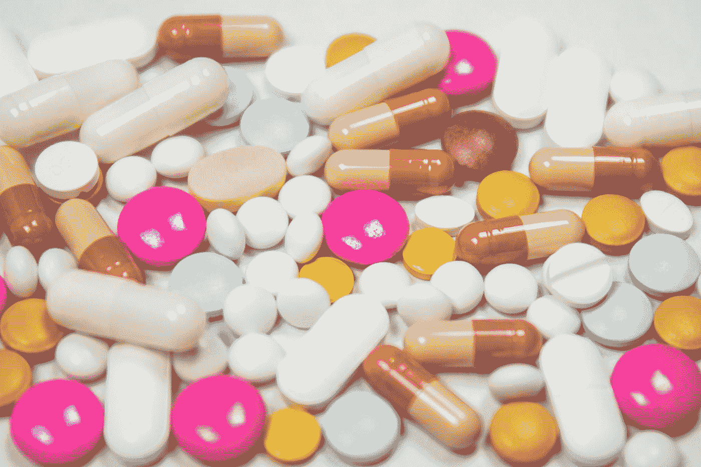

# 在罕见的情况下:我的精神副作用的可怕经历

> 原文：<https://medium.com/swlh/in-rare-cases-my-terrifying-experience-with-psychiatric-side-effects-d58959d1437>

## 当本该有效的药物变得有害时会发生什么？

Photo by [freestocks.org](https://unsplash.com/@freestocks?utm_source=medium&utm_medium=referral) on [Unsplash](https://unsplash.com?utm_source=medium&utm_medium=referral)

我进入精神病副作用的可怕世界的旅程相对较短，但影响深远。有抑郁和焦虑的病史意味着感觉到我的大脑意识到不是真的东西的认知失调是…