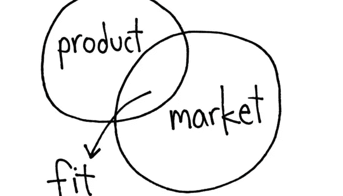

# 寻找衡量产品/市场契合度的更好方法

> 原文：<https://medium.com/swlh/in-search-of-a-better-way-to-measure-product-market-fit-584fa41d3840>

2007 年，亿万富翁马克·安德森将术语[“产品/市场契合度”引入主流词汇。在我与投资者和产品资深人士打交道的过程中，我经常听说，当产品/市场契合时，你总能感觉到。](https://pmarchive.com/guide_to_startups_part4.html)

安德森在他的文章中也生动地向我们展示了产品/市场契合的感觉:
**你** …