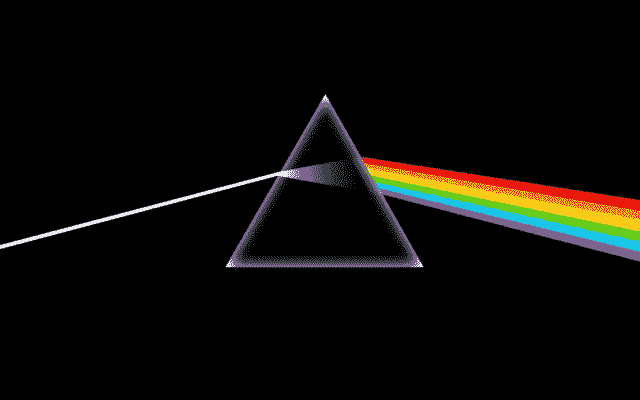

# 金钱、疯狂和时间

> 原文：<https://medium.com/swlh/in-search-of-the-dark-side-of-the-moon-2789b238bd1>

## 平克·弗洛伊德创业指南

Dark Side of the Moon album cover art

平克·弗洛伊德 1973 年的进步摇滚巨作《月亮的黑暗面》使四重奏从明星的边缘一跃成为巨大的商业成功和评论界的好评。它以创纪录的 937 周荣登公告牌排行榜榜首，并一直是最畅销的专辑之一——迄今为止已售出 4500 多万张。43 分钟的听觉过山车是一个…