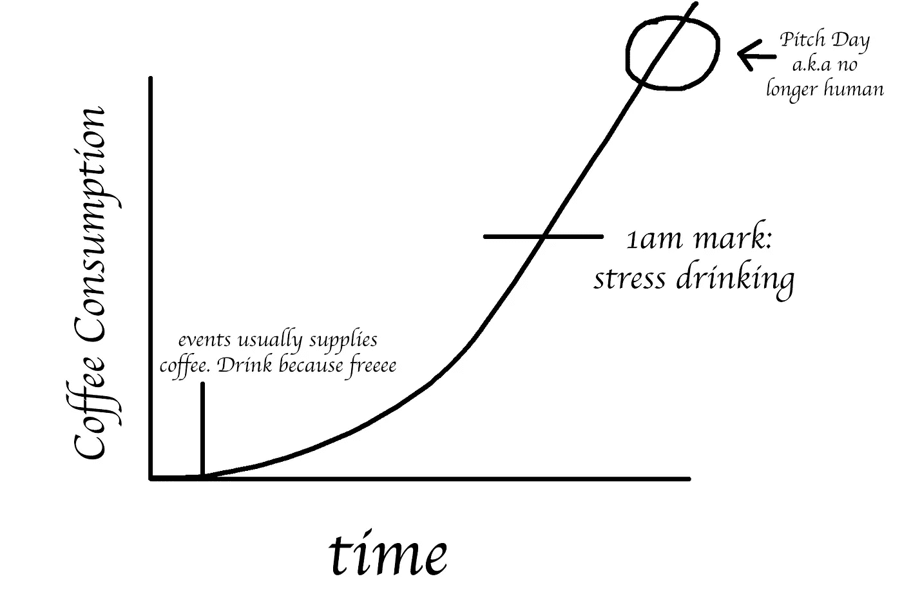

# 在黑客马拉松获胜者的脑海中

> 原文：<https://medium.com/swlh/in-the-mind-of-a-hackathon-winner-5e06ba960505>

## 我参加过的每一次黑客马拉松的经历和想法。

咖啡因输出代码是真的。每个程序员的愿望都是专注于一个没有 bug 的环境，即使我们喝了太多的咖啡。我很年轻，17 岁，渴望成为某家科技初创公司的软件工程师。有人告诉我，黑客马拉松是通向科技领域的大门，所以我带着一种天真的想法参加了黑客马拉松，认为这是一种有趣、愉快的体验，可以与其他志同道合的人见面和合作。

> 可悲的事实是:我错了。

现在，我 17 岁了，已经熬了一整夜，用一种自酿的饮料来滋养自己，让自己在凌晨 4 点保持清醒，因为距离球场日还有不到 7 个小时。焦虑、压力和睡眠不足的想法会在夜间影响我的思维，让精神崩溃随着夜晚的推移而发生。黑客马拉松不是孩子该去的地方，尤其是在推销日。这突然给了我一记重拳，因为黑客马拉松只是为了刺激每个初创公司经历的事情。

# 我的第一次黑客马拉松——24 小时。

## 主题:解决日益严重的植物真菌危机

## 结局:失败。

我在投球日崩溃了。我让我的朋友们失望了，在评委和一大群观众面前让自己难堪了。我结结巴巴地胡说八道，并开始有一个恐慌发作，而我正在介绍我们的应用程序。我和我的团队最终获得了第五名，令我惊讶的是，这并不是最后一名。这似乎是我参加的最后一次黑客马拉松了。我们的应用程序是一个使用 tracking.js 的植物疾病检测网络应用程序，它通过给植物拍照并上传到我们的网站，通过独特的颜色和图案来发现感染。我的第一次黑客马拉松毁了我对编程的感觉，我开始怀疑软件工程是否是我的正确选择。

**失败原因:**

*   想法是有的，但不是球场。
*   咖啡因上瘾。由于压力，我晚上喝了 10 多杯咖啡。可能是我演讲恐慌症发作的原因。
*   破坏心态。我低估了自己，认为我们在比赛中远远落后于其他人。给了我消极的心态。

# 我的第二次黑客马拉松——7 天

## 主题:可持续发展目标。

## 结果:国际获奖者&大多数人投票选出最佳广告。

一个失败的孩子是如何在经历了一场可怕的失败后，在 12 个国家中胜出并被选为最佳演讲的？**容易。**

> **团队合作成就梦想。**

可能是小众，但这是真的。

也许是我青春期最关键的时刻之一。这次黑客马拉松打破了我社交焦虑的外壳，让我对生活有了新的看法。我和不认识的人配对，我不喜欢认识新的人。更好的是，我的两个队友不是说英语的人/国际人士，所以沟通很困难。然而，我们设法通过了这一切。这些界限不足以阻挡我们所有人的想法。我们是志趣相投的人，有着相同的兴趣、相同的激情和相同的目标。以至于，我们在午夜有很多想法，唯一让我们保持清醒的燃料是创意的火花和我们分享的笑话，而不是我们用来保持清醒的咖啡。

我是团队领导，也是我们推销的最前线人员之一。他们相信我是一个可以将想法联系在一起的人，也是在数百人面前领导演示的受托人之一。他们对我的角色充满信心和支持，这消除了我举办最后一次黑客马拉松的感觉，这是我破坏的心态。

即使没有接触一个单独的代码，我也忽略了功能，视觉设计，把我们的想法和创造力投射到真正的工作软件中。从程序员到控制程序员的“项目经理”是一个奇怪的转变。

在我们获胜后的几个月，我开始意识到我在比赛中的角色是多么重要。我认为自己是一个幸运地得到好队友的人，并认为由于没有编码，我根本没有贡献。但我的队友和导师友好地提醒了我“没有你就不行”，这最终让我明白，我是那个在午夜联系、分享和激励我们团队的人。是我激励我们的团队不断前进。我在我的第一次黑客马拉松和我的生活中挣扎的事情是我在这次黑客马拉松和我新成立的团队中试图解决的。

哦，我差点忘了告诉你这个应用程序是关于什么的…

我们开发了一款交互式增强现实移动应用，专为发展中国家的儿童设计，让他们在有趣的游戏式体验中体验科学。我们的设计让你只需要一部带摄像头的智能手机和一张小纸片。通过这种方式，我们可以最大限度地利用学习经验，同时考虑到发展中国家的环境条件。

# 我的第三次黑客马拉松——36 小时

## 主题:帮助大海。

## 结局:第一名。&大约$$$

我从之前的黑客马拉松中学到了很多。它教会了我在这样的环境中提升自己的课程和宝贵技能。这一次，我与我第一次参加黑客马拉松的人合作。这是一个公开的比赛，欢迎大学和专业人士参加。

这第三次黑客马拉松是我从我的国际黑客马拉松和第一次学到的一次练习。我不再是我第一次参加黑客马拉松时那个社交焦虑的孩子了。我把想法变成现实，这一次，我不再低估自己面对看似不可能的挑战。这种观点有助于赢得第一名。

在这次黑客马拉松中，我体验到了期望和现实的两重性。你需要记下你所拥有的*短暂的*时间。如果你必须将最新的技术整合到你的应用中，比如虚拟现实、增强现实、机器学习或任何酷的新兴技术，确保你有这样做的知识。不要指望你能在短时间内学会，否则，你将在凌晨 3 点左右调试晦涩的代码。如果你选择这条路线，预计最低可行的产品。

**结论**

一个成功的产品就像一本完整的书。故事就在那里，从头到尾。你加入了引言，危机，然后是高潮。它一直过渡到这一章的最后。一旦这本书完成，你大声读给潜在的“投资者”。在黑客马拉松中，我们倾向于在很短的时间内编写一部 J. R. R .托尔金的史诗般的高度幻想书三部曲(指环王)，但这样做，会输出一个过量咖啡因和精神崩溃的悲剧故事。

即使你输掉了一场黑客马拉松，也不要怀恨在心。这是为了刺激早期科技创业公司的生活。不要抱着你创建的每家公司都会成功的心态，它们往往会崩盘。但这就是我们学习的方式。经典的“试错法”学习。我们做得越多，我们获得的经验就越多，这就减少了你犯错的机会。有了正确的思想、正确的团队和正确的想法，你会走得更远。

**P.S COFEE = CODE。代码=进步。进步=胜利**

## 这篇文章发表在 [The Startup](https://medium.com/swlh) 上，这是 Medium 最大的创业刊物，拥有+420，678 名读者。

## 订阅接收[我们的头条新闻](http://growthsupply.com/the-startup-newsletter/)。

