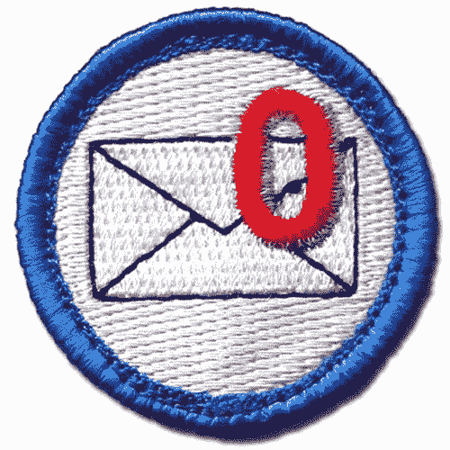

# 收件箱 0 —艰难之路

> 原文：<https://medium.com/swlh/inbox-0-the-hard-way-665099fc4c99>

**这是一种心态，而不是一种方法**

互联网上充满了管理电子邮件收件箱的“技巧和窍门”。我今天在这里分享让我连续十多年保持在“收件箱 0”的心态。我将讨论一些具体的工具和系统，但它实际上是一种心态和一系列行为，让我能够专注于和响应来自我的客户、员工和团队的交流。

下面我将分享三条超越特定软件、技巧或诀窍的规则，它们将在你的职业生涯中解决你的“电子邮件问题”。如果你想增加你作为一个强有力的沟通者、高效的领导者和团队成员的声誉，那么继续读下去。

> **规则 1——降低噪音放大信号**

零收件箱的第一步是减少你收到的邮件数量。

最简单的开始方法是消除你从机器人那里收到的电子邮件。继续下去，取消订阅营销邮件，选择退出你从来没有读过的通知，并对注册新的保持警惕。

我们每天都会收到垃圾邮件，但从今天开始，你将会以不同的方式处理它们。与其忽视它们，或者用翻白眼的方式删除/存档它们，不如投入 90 秒的时间来选择退出。如果你有 Gmail，这比以往任何时候都容易，因为大多数通信都有退订按钮，但即使没有，你也要花 90 秒的时间点击每封邮件页脚的退订链接，填写表格并选择退出。

一旦你控制了“来自机器人的邮件”，更难的一步是管理你从真人那里收到的邮件数量。如果你像我们大多数人一样，这些是来自同事、老板和员工的与工作有关的电子邮件。有些邮件是无关紧要的废话，有些需要紧急行动，有些则介于两者之间。更糟糕的是，老板和同事的信息没有退订按钮。

如果有人给你发邮件，而你真的不想再收到，我建议你重新训练发邮件的人。我的方法简单，礼貌，并且始终如一。每当你收到一封不想再收到的邮件，你都需要快速礼貌地回复:“约翰，感谢你每周更新的捕蝇草健康状况。不幸的是，我每天都会收到大量的电子邮件，要求把我从你的更新列表中删除。当然，如果你需要我做什么，请告诉我，或者打我的手机 555-555-5555。”

如果是更私人的关系或直接报告，你可以考虑面对面地传递同等的信息。如果是老板或经理，你可能需要缓和这种信息，但是如果他们坚持把你包括在他们的邮件中，那么继续接收这种特殊的信息可能对你最有利。

这种“人类选择退出”策略最重要的一点是，每次当发件人给你发一封不必要的邮件时，你都要坚持不懈地把这条信息传递给他们。对人类来说，习惯的改变比机器人更难，但在几周之后，你会发现习惯的改变会对接收信息的数量产生影响。

现在，如果你读过其他文章或收件箱零策略，你可能会想“为什么我不能设置一个过滤器，建立收件箱规则，或使用第三方工具来确保我不会看到这些不想要的电子邮件？”在我看来，任何导致发送者和预期接收者之间期望不一致的策略都会带来麻烦。你最不想要的就是有一个同事认为他们在和你交流(毕竟他们在发邮件)，但是你几天都没有看那些邮件，或者根本没有。这是沟通不畅、沮丧和失败的原因。这不是收件箱零，这是收件箱疏忽。

关于规则 1:减少噪音放大信号，我的最后一个想法是，当你考虑减少通信量时，你也需要考虑你所有的收件箱。这可能是另一篇文章的主题，但事实上，我们都有许多收件箱需要管理。根据该规则，多个电子邮件帐户、垃圾邮件和通过社交媒体的通信都可以被视为收件箱。

如果你想知道我是如何设置和管理我的 4 个闲置账户的提醒/通知设置的，请在下面的评论中告诉我。

> **规则 2——你的收件箱只有一个任务**

如果你把规则 1 放在心上，你现在每天收到的邮件越来越少了。对于我们大多数人来说，这意味着我们仍然有大量的电子邮件需要阅读、考虑和回复。规则 2 是承认你的收件箱只有一个任务。收件箱是需要及时筛选和回复的通信队列。不幸的是，我们中的许多人将收件箱用于其他功能，所有这些都削弱了它完成一项工作的能力。这也增加了收件箱分类的认知负荷，我将在下面的规则 3 中详细讨论。

**2A 法则:你的收件箱不是待办事项列表**

如果你还没有，我强烈建议你建立一个与你的电子邮件收件箱不同的待办事项列表。我使用体式，这让我可以快速轻松地创建任务，更重要的是，给每个任务分配一个截止日期。在 Asana 之前，我使用 Outlook 的任务列表，但当时这些任务还不能通过移动设备优雅地完成。有很多数字任务列表工具可以很好地执行。随便挑一个，那个简单好用。

2B 法则:你的收件箱不是参考图书馆

偶尔一封电子邮件包含你以后需要参考的重要信息。有些人会把这些邮件放在他们的收件箱里以便参考，我受到了诱惑，但是我们的收件箱只有一个任务。你需要建立一个系统来存储你以后需要回忆的信息。对我来说，我用 Evernote 处理最重要的细节，其他的事情我都信任 Gmail 的存档和搜索功能。当我需要的时候，我如何记得我把那些细节藏在哪里？我会经常在我的待办事项清单上记下一些重要的细节，比如“给约翰·史密斯买一份生日礼物(把他的愿望清单保存到 Evernote 上)”

现在我们已经清楚地定义了收件箱不是什么，我们可以把精力集中在它应该是什么，一个准备好进行分类的未处理通信列表。一旦你建立了你的数字待办事项列表和参考图书馆，让我们来谈谈规则 3 和持续分类你的电子邮件收件箱所需的纪律。

> **规则 3——快速分类，及时响应**

既然我们已经讨论了规则 1 和 2，我将与你分享我是如何筛选和回复我的单一目的收件箱的。这是我在过去十年里一直用来保持收件箱零号的工作流程和习惯。以下是我每次打开收件箱，查看一组新的未读邮件时遵循的流程(哦，太好了。)

我收到的每封电子邮件都是按照收到的顺序进行处理的，在打开每封邮件后，我会对它们进行分类，并根据下面的分类采取行动:

**不需要任何操作，电子邮件不需要继续**

*   取消订阅，请参见上面的规则 1
*   存档电子邮件

**不需要采取行动，但电子邮件非常有用/信息丰富，值得期待**

*   存档电子邮件

**需要行动或响应，行动/响应需要不到 60 秒**

*   立即回复或采取行动
*   存档电子邮件

**需要行动或响应，行动/响应需要超过 60 秒**

*   创建一个快速待办事项，指定一个合适的截止日期
*   档案馆

**需要紧急行动或响应**

*   如果你真的需要尽快回复。那就去吧，忘记这些“规则！”这种情况多长时间发生一次？
*   你的收件箱空空如也，你能尽快看到邮件，并能如此迅速地回复，难道你不开心吗？

请注意，在所有这些情况下，您都不会在处理完电子邮件后将其留在收件箱中。这里的关键是，每封邮件的审查和分类时间不到 60 秒，其中许多不到 20 秒。没错，各位，你们已经到达收件箱 0。

当然，你不会整天无所事事，只是等待新邮件。你的一天也充满了需要完成的工作、会议和其他让你远离收件箱的事情。我建议在重要会议或其他活动之间找 2 到 3 分钟的休息时间来分类你的收件箱。记住，每封邮件不到 60 秒，你可以在 2 分钟内浏览完上次会议中收到的 7 封邮件，在接下来的事情发生之前，你还有时间重新装满你的咖啡杯。

如果你足够幸运，有几个小时不受干扰的工作时间，你还需要找到精神空间来专注于你设计的界面，报告你的草稿，或者编写代码。我非常相信一次做一件事，并找到精神空间去埋头苦干。我对平衡深度工作时间和收件箱管理的建议是试验一下[番茄工作法](https://en.wikipedia.org/wiki/Pomodoro_Technique)。

番茄工作法是一种最大化深度工作效率的策略，方法是集中注意力 25 分钟，不要分心(关闭你的电子邮件收件箱，静音通知等等)，然后休息 5 分钟。如果你一整天都在埋头写小说，你可以将这些会议首尾相连，这样循环 4 次后，你可以考虑更长的 30 分钟休息时间。根据我的经验，深度聚焦工作之间的 5 分钟休息时间是对你的收件箱进行分类的好机会

总之，我相信这种“零收件箱心态”对任何人、任何角色来说都是可以实现的，只要遵循我上面概述的三条规则。我还认为这是一种比任何依靠软件来管理收件箱的“黑客”更高级的训练。这是过去十年我一直在做的事情。

感谢阅读！

詹姆斯