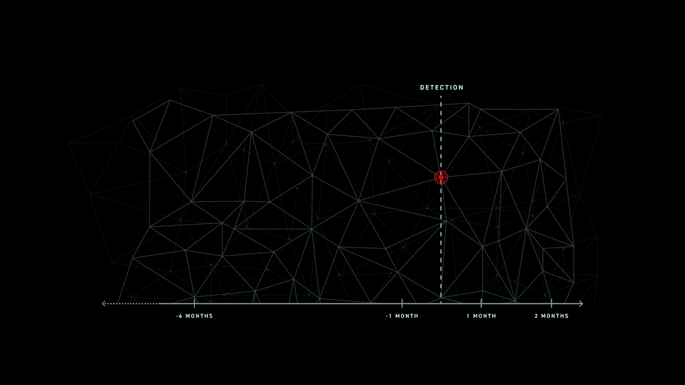

# 事件响应:不要让数据过时

> 原文：<https://medium.com/swlh/incident-response-data-aging-out-5e09034d241b>

[Connect the dots. Complete the picture.](https://www.cybereason.com/resources/post-incident-review)

“ *56%的漏洞需要数月或更长时间才能发现*”是最近的[威瑞森 DBIR 2019](https://enterprise.verizon.com/resources/reports/dbir/) 的一个收获。不幸的是，这并不是什么惊天动地的消息。不管你问谁，目前的检测和响应时间状态在整个行业都是不可接受的。

在许多情况下，它代表了安全团队需要面对和准备的现实。虽然我们经常将发现的深度或检测的能力作为安全性的衡量标准，但我们往往会忽略时间保留的因素。

Anton Chuvakin 的一篇【Gartner 博客中，他提出了一个有效的观点(甚至在发表 6 年后仍然有效)，即“*如果检测滞后期长于证据保留期，你会改进哪一个？您是将数据存储更长时间，还是提高了检测能力？*”。

# “*我们被攻破了吗？*”

无论是实时检测、针对已知恶意软件实施预防性控制，还是发现具有未知 TTP 和零日的高级对手，检测都至关重要。然而，读心的安东的博客中出现了其他东西。安全团队需要数据来完成整个组织从头到尾的危害调查的次数根本不存在。让我重复一遍，数据**不在那里**。

公众和高级管理人员的印象是，某个地方有一个红色或绿色的屏幕，显示是否发生了违规。事实是，必须对违规和影响进行计算，这是一门不完善的科学，缺乏可用的数据。安全团队负责澄清这些问题:“我们被入侵了吗？”，“我们受到影响了吗？”。然而，在明确的答案至关重要的地方，安全团队(也)经常被留下开放式的问题。这是为什么呢？

让我们浏览一下安全团队在调查过程中最常获得和使用的每个数据源(假设发生了检测)，以及它们对[事件响应流程](https://www.cybereason.com/resources/post-incident-review)的影响，特别关注“*个月或更长时间*”。

*   虽然 ***安全信息和事件管理(SIEM)*** 系统为安全分析师提供了丰富的功能集，但 SIEM 部署和管理的主要驱动因素之一仍然是法规遵从性要求。因此，数据保留最佳实践是由需求和被需求驱动的。包括收集的数据及其各自的保留期。PCI DSS 是一个很好的例子，说明了强制与检测、调查和响应的关系。对于 SIEM 系统，有两个方面需要考虑:可用于查询的元数据与在冷存储中归档的数据(或者干脆弃用……)，以及安全分析师搜索每一项所需的时间。
*   借助 ***网络威胁分析(NTA)*** & ***网络取证*** ，事件响应期间的增值显而易见，捕获和存储完整的数据包捕获非常昂贵，因此仅限于 2-4 周(仅包括入站/出站，不包括东/西)的原始数据，最好的情况下还有几周的元数据。在这种情况下，法规没有发挥作用(还没有),但对处理数 Pb 数据的机器能力的影响以及提到的成本是一个致命弱点。
*   **任何类型的云交付应用** (SaaS)，无论是 [SIEM](https://www.trustwave.com/en-us/) 、NTA、 [EDR](https://www.cybereason.com/platform/endpoint-detection-response-edr) 、UEBA 等。既有优点也有缺点。无需提及所涉及的(缺乏)管理和部署难题，但是数据成本已经转移到应用程序端，没有兴趣“开始购买设备”并为所有存储的数据付费。然而，我们又一次回到了“T18”个月或更长时间的“T19”时期，那里根本没有数据。

# **错误数据—溢出。右数据—缺失。**

在潜在违规调查期间，人们期望安全团队能够快速、准确地做出反应。然而，现实证明，安全分析师被冗长、手动和耗时的任务所困扰，无法快速响应。其中一个主要障碍是*数据不存在*或*有限的数据只存在于冷存储中*这使得手头的任务搜寻和关联孤立的数据点几乎不可能。

问题始于拥有(正确的)数据或获得对存档数据的访问权，但这只是战斗的一半。让我们暂时假设我们有多年的可用数据，这就足够了吗？这仅仅是一个好的起点吗？在享受了筛选原始的、无索引的数据试图找到“火山口中的针”的“快乐”之后，如果我能够找到我想要的东西，我认为自己非常幸运，但大多数时候这几乎是一项不可能完成的任务。

> 我们用一个具体的例子。检测到一种新的大规模敌方工具。此时，全球各地的安全团队都在问自己，他们的高管也在问自己，他们是否会受到这一新工具的影响。在这种情况下，对 C2 IP、可执行散列文件或 baddomain.com 执行 CTRL+F 不会成功。需要一种更复杂的搜索 TTP 的方法来发现对手工具留下的任何碎屑，并在相关的情况下，确定攻击在整个组织中的传播范围。在这种情况下，以识别攻击者 TTP 为目的的查询历史数据至关重要。

# **用面向未来的智能展望过去**

在*回到未来*中，马蒂·小飞侠是历史时期应用未来智能的先驱，他不可能在没有“未来反响”的情况下做出任何改变，恰恰相反(回到过去？！)是当今世界安全团队所需要的。回到过去，没有任何限制，应用今天可用的 TTPs & IOCs 情报并揭露攻击者“告诉”**不管**特定的 TTP、特定的机器或特定的时间范围。

回到我们最初的观点，随着大规模数据泄露成为常态，尽管我们不喜欢它，但我们更经常面临的任务是解决“我们是否受到这种新泄露的影响？我需要尽快得到答复”。

让团队在正确的时间拥有正确的数据，以及当时和现在已知的所有背景，这就是游戏的名字。这是关于有针对性的外科手术回忆，有能力[用我们现在知道的未来知识的好处来重演当时的世界](https://www.cybereason.com/platform/replay)。

> ***当保留和云操作计算能力变得无关紧要的那一天——想象一下。***

*本帖由*[*cyber eason*](https://www.linkedin.com/in/maorfranco/)*全球产品及合作伙伴营销总监*[*Maor Franco 撰写。Maor Franco 拥有十多年的网络安全产品开发经验。他在 RSA 担任过多种职务，从研究分析师到产品管理，再到产品营销。他还负责 NetWitness 平台的产品营销，包括 Endpoint、Network Forensics、SIEM 和 SOAR。在 Twitter 上关注 Maor*](https://www.cybereason.com)[*@ Maor Franco*](https://twitter.com/MaorFranco)*。*