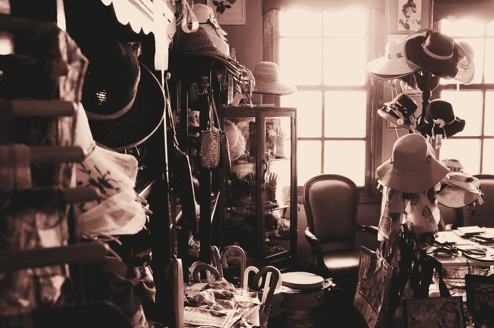

# “销量增加”意味着更大的垃圾填埋场和杂乱的房屋

> 原文：<https://medium.com/swlh/increased-sales-means-bigger-landfills-and-cluttered-homes-2c73adf855a6>

## 我们的经济是建立在卖东西的基础上的，但是他们去哪里了呢？

Photo by [Onur Bahçıvancılar](https://unsplash.com/@citrusboy?utm_source=medium&utm_medium=referral) on [Unsplash](https://unsplash.com?utm_source=medium&utm_medium=referral)

众所周知，在工业化世界，我们有太多的东西。事实上，太多了，以至于人们甚至在家里都没有地方放它。这就是为什么存储设施和组织供应商店如此受欢迎。购物被认为是一种…