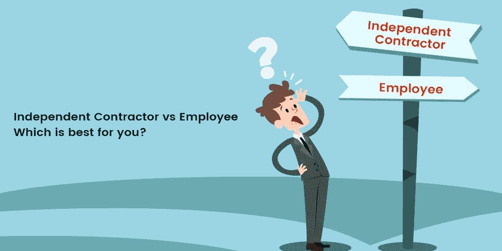
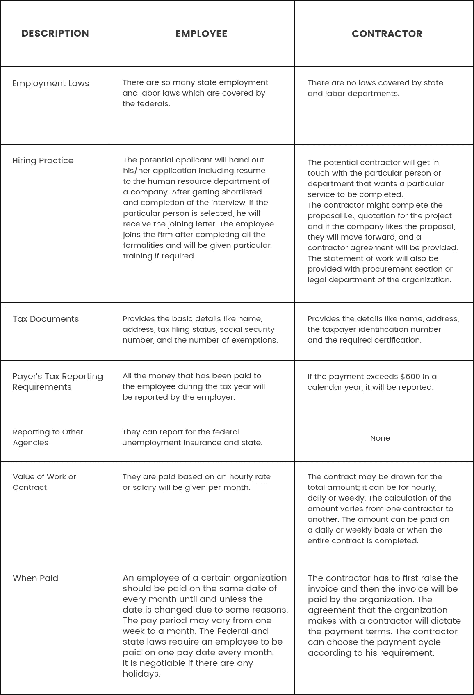

# 独立承包人与雇员:真正的区别

> 原文：<https://medium.com/swlh/independent-contractor-vs-employee-the-real-difference-8b80c42107fc>

Independent Contractor vs Employee

在你的商业生活中，你可能会对独立承包人和雇员这两个术语感到困惑。任何企业在完成工作时都有两种选择。他们可以雇佣员工，也可以与独立承包商合作。

独立承包商和雇员[之间有很多不同之处，你必须注意。让我们举一个软件开发商的例子，你的公司需要开发软件，正在寻找合适的人来做这件事。有这么多的自由职业者提供开发服务，或者你可以雇用一名员工进行开发。无论哪种方式，软件都会被开发，重要的是你决定谁更可靠。](https://en.wikipedia.org/wiki/Independent_contractor)

下图显示了雇用独立承包商和雇员之间的快速差异。

# **公司员工的重要性**

独立承包商和雇员之间有着巨大的差异。以下是说明公司员工有多重要的一些原因-

**敬业忠诚**

如果你[以工资为基础为你的公司雇佣资源](https://technostacks.com/hire-resources)，这个人就必须遵守公司的规章制度。他/她将忠于组织，只为你的公司提供全职服务。除了你的项目，他们不会把工作时间花在其他项目上。这将为您提供一种获得个性化服务的感觉。员工的忠诚会带来更高的生产率。员工会帮助公司成长，他们甚至会在需要的时候帮助公司。就像你对工作的承诺一样，员工也会保持承诺，为你提供服务。

**改进的工作流程**

企业随时都可能出现转机，拥有能够支持你的员工非常重要。每当公司面临困境时，员工总是能派上用场。他们会提供支持，如果需要的话，他们会参与不止一个项目。如果你有多个软件要开发，你雇佣的开发人员会在这个过程中帮助你，并且会花费大量的时间为你的组织提供解决方案。

**众多角色**

如果您的组织很小，那么您需要能够执行各种角色的员工。开发人员不仅仅局限于软件开发，他/她还会在项目管理或你需要的任何其他额外工作中提供帮助。开发人员将负责一些需要监控的其他工作。这样，员工将帮助组织成长。

**完全控制员工**

当雇员在组织中时，雇主将完全控制他/她。您将能够决定他们在开发过程中必须使用哪些工具，何时参与项目，何时不参与，等等。您将能够一直监控和跟踪该员工。

当涉及到一个独立的承包商时，你必须时不时地跟踪这个人，以了解工作的最新情况。你应该努力去了解项目的进展情况。由于此人是独立承包商，当你与他一起工作时，你必须时刻保持警惕，而且他/她最终交付给你的产品质量没有保证。

**没有固定利率**

你可能会找到一个好的独立承包商，但承包商对不同的项目收取不同的费用。这可能会成为你的负担。由于承包商必须安排工具和所有其他所需产品，他们向您收取包括所有这些费用在内的费用。这些费用会不时变化，有时您可能需要支付更多的费用。

**灵活的工作时间**

办公室职员更加灵活。他们将在工作时间内随时为你服务。你可以让这些员工帮助你完成其他各种任务。但是独立承包人的情况不同。这个人作为一个单一的实体运作，他还与许多其他组织合作。这可能会给你带来一些问题。他们不会一直参加会议和其他讨论，你也没有义务告诉他们如何完成工作。你所能做的就是分配项目并设定最后期限。

# **成功公司员工的例子**

鲍勃经营自己的生意，他需要为他的商业应用开发[移动应用](https://technostacks.com/mobile-app-development)。他雇佣了一个独立的承包商，并向他解释了他的[餐厅应用程序项目](https://technostacks.com/our-work/restaurant-application/)的需求。在项目期间，当他注意到项目的性能下降，并且开发商也没有在确切的时间回答他。开发商说，他不会总是有空，因为他也有另一个项目的发展。

之后，Bob 决定为他的项目雇佣员工开发人员。他注意到公司定期向他提供项目进展的最新信息，并且在 bob 想要联系他们的时候也可以联系到他。最后，他已经完成了他的项目，并取得了预期的结果。

# **为什么雇佣员工比雇佣独立承包商更好？**

当你雇佣一个员工时，你个人有机会评估这个人并雇佣他们。通过这种方式，你将了解员工的技能，你可以用你希望他们学习的技能来培训他们。但是独立承包人的情况不同。你无法具体了解这个人。

承包商有完全的工作自由，他/她可以决定如何工作、在哪里工作以及何时工作。他们不会遵守你为工作制定的任何规章制度。你无法监督他们，他们只是在工作完成后向你展示。这样你就无法控制这个项目了。这些人不够灵活，不会在必要的时候花时间陪你。由于他们同时从事多个项目，他们无法在任何必要的时候会见客户。

与独立承包商和员工的业务关系非常不同。专业和非专业的独立承包商都有，雇佣他们中的一个可能会导致巨大的或灾难性的后果。但是如果你为你的组织雇佣了一个员工，你可以按照公司的要求培训这个员工，并给他们分配需要的任务。

这些承包商不一定只为你的组织工作，他们也可能与其他雇主合作。这可能会降低他们的工作质量。由于独立承包商的存在，这些问题如此之多，以至于这些公司都在苦苦挣扎。

这些公司面对独立承包商的另一个问题是，他们可以将工作分包给其他方。是的，会发生这种情况。独立承包商将工作分配给第三方的情况比比皆是。工作质量可能会下降，因为工作已经委托给第三方。

# **总结**

所以，如果你想有一个稳定的工作流程，并时不时地监督项目中的员工，那么最好的方法就是雇佣一名员工。员工可以成为你组织的资产，而承包商只是完成工作，拿了钱就消失了。

## 这篇文章发表在[《创业](https://medium.com/swlh)》上，这是 Medium 最大的创业刊物，有+436，678 人关注。

## 在这里订阅接收[我们的头条新闻](https://growthsupply.com/the-startup-newsletter/)。

