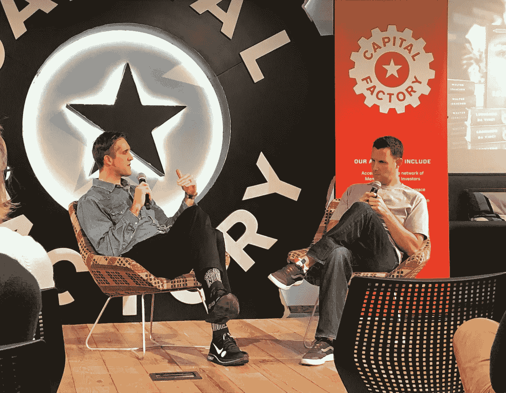

# Indie.vc v3:奥斯汀(路演 2019)

> 原文：<https://medium.com/swlh/indie-vc-v3-austin-roadshow-2019-e17399135648>

*Bryce Roberts (Indie.vc) & David Hauser (Grasshopper) discussing David’s un-VC path to a $150M+ exit.*

[Indie.vc 试图进行的对话是一个热门话题，冬季巡回赛的部分目标是**解决风险投资与 bootstrap 辩论**的任何错误描述，这往往会成为个人经历和偏见，没有帮助。](https://medium.com/u/510b99e51849#1 on Hacker News and took over startup twitter for a while.</figcaption></figure>
</figure>
</figure>
</figure>
</figure>
 经营我自己的公司，我从来没有投资组合的方法。我只有一场比赛，我必须赢，不像我的投资者。
> 
> ——大卫·豪泽，蚱蜢

Grasshopper 的创始人大卫·豪泽(David Hauser)创建了这家公司，收入超过 1000 万美元，并以超过 1.5 亿美元的价格卖给了思杰(Citrix)。(*注:我们后来了解到，在退出*时，他们的工资表上只有两个人。

大卫和他的商业伙伴只是两个想要创业的人，而不是复杂/精明的技术专家，所以他们必须在旅途中学习很多东西。

大卫之前的经历是从纽约的一家风投那里获得资金，后者引入了管理团队。大卫不喜欢那次经历。

**战壕里的自举例子:**第一次给蚂蚱买装备；成本是 25 万美元，但他们只有 10 万美元。由于资金紧张，他们发挥了创造力，想出了如何付给他 90 英镑而不是预付。他们有一种不惜一切代价的精神。

在 Grasshopper，他们还有一个实验室功能，在那里他们建立了其他公司，最著名的是 [Chargify](https://www.chargify.com) 。但大卫承认，即使蚱蜢取得了成功，他们也有资本(风险债务)，所以他们有时可以玩得松一点，做错一些事情……“我认为在某些情况下，如果没有资本，我们会更成功。”当你有了钱，你就把它花掉，而不是变得有创造力。

有约束的好处:大卫和他的商业伙伴自己做所有的事情(至少一开始是这样)，而不是雇佣别人。“实际上，我们自己做的每一项工作。”接销售电话，插 T1 线，所有的事情。

布莱斯:必须做到资本高效:密切管理你的运营，在招聘上保持保守，真正理解商业杠杆。这通过学习每一个功能领域创造了杠杆作用。我发现这有很大的不同。

大卫:是的，事实证明我们在 1-5 年中学到的东西对收购者非常有价值。我们是更有吸引力的企业。他们喜欢收购有增值现金流、有利可图的企业。

布莱斯:你会如何对比草蜢和你那些资金雄厚的竞争对手？RingCentral 得到了红杉资本的资助，进行了首次公开募股。

**大卫:**当你回头看这些数字时——虽然首次公开募股比我们的销售额大，但他们每个创始人赚的钱少得多，少了好几倍。对于创始人来说，这是一个纯粹的结果，意义重大。

**Bryce:** 看着竞争对手拥有这些声望很高的支持者，你的心理受到了怎样的影响？

大卫:我们忽略了所有的竞争对手。我们不关心他们的定价；我们不关心他们在做什么。我们比竞争对手晚 5 年加入短信服务，因为*客户没有要求*。团队中最大的挫折是我们“缺乏 TechCrunch 报道”与此同时，环中心有网络电话，钱，覆盖面。

**Bryce:** 资金变得紧张，你会怎么做？

**大卫:**我们解雇了公关公司，雇佣了一名 Jr 销售人员，让他们向作家推销，这样就涵盖了数百篇文章。他们作为销售人员获得 3 万到 4 万美元的基本工资，佣金很高，在 7.5 万到 8 万美元之间。我们建议的俯仰角与资金无关。"来自巴布森学院的两个疯狂的年轻创始人！"无论我们需要什么来引起他们的注意。

## 现场问答

**问(代表大卫):“在你卖掉 Grasshopper 之前，它是什么样子的(大致按部门划分的人数)？**

答:42 人中有 10 名工程师，大量营销人员、24x7 全天候运营人员、呼叫中心人员，没有销售团队人员(全部为外来人员)。

问(代表大卫):“你在招聘前是如何考虑《天桥》的？”

答:我们没有考虑 t 台。专注于销售。没有后端 CRM。当我们接受订单时，我正在输入 SQL 语句来查找客户名称。

**问(布莱斯对大卫):“你是 Indie.vc 的 LP，为什么？是什么引起了你的共鸣？”**

答:那时我已经做了 50-60 笔投资。我从未对条款的表述方式感到兴奋…我喜欢自举…但证明有其他方式的投资条款怎么样？第二件事……找到一种比典型结构更能让我和创始人保持一致的结构。不是纯粹基于筹款轮，这不符合我和企业家。经营我自己的公司，我从来没有投资组合的方法。我只有一场比赛，我必须赢，不像我的投资者。就结果而言，差异相当大。对我们来说，返还给 Grasshopper 创始人的钱要多得多。我们的球台有两个人。因此，我们甚至不需要达到 10 亿美元就能获得改变生活的结果。我们卖了 1 亿美元。对风投来说，这不是一个好的回报。

问(代表大卫):“作为团队中的第 N 名员工，员工对公平有期望。如果你是自举……不打算卖，你有什么建议？”

答:在纽约的 Grasshopper，人才竞争非常激烈。我们总是被问到这个问题。但是……我们没有给任何人股权，因为我们从来没有想过要卖掉公司。相反，我们支付的薪水高于平均水平——大大高于平均水平。我们还能够根据管理层的决定建立一个资金池来支付年度奖金。如果退出，我们会为管理团队拨款，因为我们说过，如果我们真的出售，我们会照顾你。对于员工，我们有一个活跃的利润分享池，每年更新。

(为布莱斯)问:“你的投资者如何衡量你的成功？相对于传统风投的有限合伙人，他们的期望是什么？”

答:他们习惯了内部收益率，但我们不能使用它……我们仍在努力……我们的初创公司是盈利的，收入在增长……**我们相信他们最终会获得比被加价更好的回报。**我可能低估了重新布线所需的工作量，但我们很幸运，现在已经有 4 家基金拥有优秀的 LP。我们确实把自己框定为 VC。我们相信，在传统的风险投资回报率方面，我们将具有竞争力。17 项投资中，16 项仍在运营。可能有一个故事说以前是 0 的，现在是 1，2，3。全垒打仍然是全垒打。

**问(布莱斯):“你如何比较 LighterCapital 和 indie.vc？”**

答:打火机是非常典型的债务，他们会在第一个月拿走他们的份额。在创始人需要从事回购计划之前，我们可以给 18 个月到 3 年的时间。因为我们不借贷，我们没有资本成本。如果一个创始人在争论两个中的一个…打火机可能最终会是比我们更好的伙伴。但是我们提供的不仅仅是现金。我们正在提供一个令人惊叹的创始人社区，战略支持，以及如何真正发展您的业务的建议——这在我们投资的公司中可以明显看到。

**问(代表布莱斯):“你投资什么行业或什么类型的公司？”**

答:除了对国际化不温不火之外，我们相当不知道地理位置。我们在寻找什么——很难说……一个肩膀上的芯片比特定的行业更重要。那些和我们有着共同 DNA 的人。Indie.vc 可能没有意义的商业模式:开发和商业化之间的长期滞后，赢家通吃，武器化的资产负债表可以成为竞争优势——这些都不适合我们。我们也希望人们不害怕销售……愿意发展真正的销售文化。这种心态让你尽可能地接近你的客户和事实真相。当创始人避免打电话和客户交谈时，这种情况很糟糕。

**问(代表 Bryce):“这种形式的融资能在更长的销售周期中发挥作用吗？”**

答:我们确实有一家投资组合公司向政府销售产品。诀窍是不要相信你的销售和扩展速度会比实际情况更快。陷入困境的风险投资公司是那些认为他们已经破解了缩短销售周期的密码的公司(但他们没有)。我们想知道销售活动开始和结束之间的延迟风险是否值得。

**问(代表布莱斯):“一旦你的投资组合公司申请并进入第三版，你会提供什么好处或资源？”**

答:在过去的几年里，有一件事已经成为秘密武器……外面有很多大卫……他们没有机会谈论他们是如何建立自己的企业的。我们正试图创造一个创业者的另类世界，让他们沿着这些思路思考和建设。他们谈论自己的业务与那些谈论只筹集 A 轮或 b 轮资金的人不同。我们希望让创始人接触那些知道如何建立真正的企业的人。正如一位创始人最近所说的，我们提供“刚好够的风险投资 b”——责任，你知道每个月都会打来的电话…情况如何，你是否达到了目标，错过了目标，为什么…

**问(布莱斯):“如果一家初创公司无法向 Indie.vc 支付赎回款项，会发生什么？”**

答:在这种情况下(这种情况还没有发生)，我们确实有权利强制还款——换句话说，找到一个贷款人来收购我们……但我们在整个过程中试图做的是*而不是*成为贷款人……我们是合作伙伴。

**问(代表布莱斯):“还有谁在提供这些替代融资结构？”**

答: [TinySeed](https://tinyseed.com/) & [保证金](https://earnestcapital.com/)是成立做预收益类型的公司。我们也和 Clearbank，LighterCapital 混为一谈。我们的重点是股权效率高的企业。我们能否创造出更多的[金融]工具，让企业家能够利用它们来建立自己的企业？

## 结束语(布莱斯)

在过去的 4 年里，他反复得出的结论是，对于大多数公司来说，这是一个更好的模式。

如果 Indie.vc 可以通过结构、叙事或社区来鼓励这一点……如果他们可以沿着这条道路支持公司……我们将会看到更多蚱蜢一样的公司。最近的例子:Qualtrics，Github。

我们太容易失去那些公司的线索了。通过尽早关注客户、收入和利润而产生的魔力。他们想推倒墙来证明还有另一条路。他们希望提供足够的资金，让企业家继续他们的道路，而不必吞下传统模式带来的一切。

**结束**

*感谢阅读。如果你喜欢这些笔记，你可能会喜欢我最近写的关于* [*替代融资模式*](/swlh/the-new-bootstrappers-how-alternative-funding-models-are-embracing-founder-lifestyles-bd66a6656120) *和* [*早期投资的未来*](/swlh/rise-of-the-transformers-db7887c26689) *。也可以* [*在 twitter 上关注我*](https://twitter.com/mattwensing) *。*

## 这篇文章发表在 [The Startup](https://medium.com/swlh) 上，这是 Medium 最大的创业刊物，拥有+412，714 名读者。

## 在这里订阅接收[我们的头条新闻](http://growthsupply.com/the-startup-newsletter/)。

