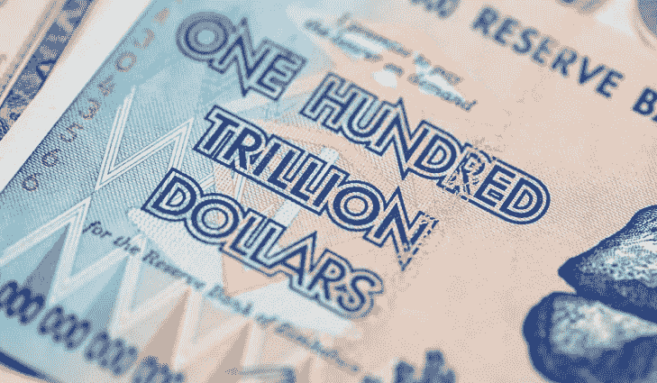
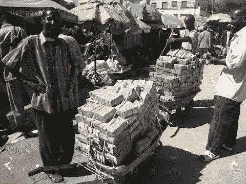

# 通货膨胀国家——为什么钱不再值印钱的纸了

> 原文：<https://medium.com/swlh/inflation-nation-why-money-isnt-worth-the-paper-it-s-printed-on-anymore-a8ac55dd0467>

当我还是个小孩子的时候，拜访爷爷奶奶时，我会做的一件有趣的事情就是去当地的街角小店买一袋糖果。那是 80 年代，你可以很容易地用一美元买到糖。

我妈妈会笑着说，她记得自己小时候去过那个街角的商店，笑话是她可以花 25 美分买到一袋薯条、一瓶软饮料和一块巧克力。现在我的孩子几乎不能从口香糖贩卖机里买到那个价格的东西了！

我的祖父母在组建家庭时花了大约 4000 美元买了他们的房子。我父母用 40，000 美元抵押贷款建的。几十年后，我的价格远远超过 40 万美元。

我的祖父母曾经用 100 美元的预算养活一个大家庭一个月。小时候，我和父母一起去杂货店购物，100 美元可以让购物车装满食物和好吃的东西，轻松维持一周。现在…我可能会很幸运，两手各拿一个包走出商店，得到 100 美元！

所以我们倾向于想当然地认为价格会持续上涨，但是为什么会这样呢？

通货膨胀是定义经济中商品和服务成本增长百分比的术语。换句话说，我们买的东西的价格上涨了多少。

我的祖父母靠一份平均收入养活了一个有 8 个孩子的家庭。我父母那一代人可以靠一份收入和一份兼职工作养活两个孩子。80 年代的双收入给你提供了很多财务选择。

如今，大多数家庭都很难做到收支平衡，因为父母都要全职工作，许多家庭都在寻找额外的收入机会。

老实说，我的祖父母没有 3000 平方英尺的双层车库和两辆豪华汽车。

我的父母没有互联网或手机账单、iPads、笔记本电脑，私立曲棍球学校也不是问题。上大学可以用一份体面的暑期工作来支付。

> 底线是，通货膨胀是真实的，在制定财务计划和决策时必须考虑进去。

美联储的目标是每年增长 2%。这意味着平均而言，生活成本上升了 2%或更多，这取决于你住在哪里。

因此，如果你每年至少没有获得 2%的加薪，你就落后了。越来越多的人开始感受到这方面的压力，这表现在人们承担的消费者债务越来越多。

同样，对于任何不能产生高回报的投资来说，你得到的可能没有你想象的那么多。

在我成长的时候，如果你为退休存了一百万美元，你会感觉很好。今天，对大多数人来说，这远远不够。

特别是如果你离退休还有 25-30 年或者更长时间，通货膨胀会让你的退休基金看起来很小。

那么是什么导致了通货膨胀呢？其中一部分可以简单地称为——提供和需求。如果供不应求，价格就会上涨。

另一大部分是投入流通的货币总量(T2)。无论是政府还是银行……如果货币供应量(印刷了多少现金)上升，那么这种货币的价值就会被稀释。

**这里有一个例子可能有助于说明我的观点:**

想象一下，你被邀请参加一个慈善拍卖，你支付了活动的门票费，然后每个人都在晚上得到一定数量的“假钱”。你可以用这些钱玩各种游戏，如扑克、轮盘或嘉年华类型的游戏，并有希望在晚上赢得比开始时更多的“假钱”，稍后你可以用这些钱在拍卖会上竞拍奖品。

因此，你发现自己在晚会结束时，对加勒比海之旅大奖之一的竞标开始了。你真的想要这次旅行，你把晚上的所有奖金都留给了这次旅行。

出价从 1500 美元慢慢开始，然后是 1525 美元，1550 美元，因为人们开始尽可能多地出价。

当出价发生时，21 点桌上的一个庄家在结束他的夜晚时，意识到他还有一堆剩余的“假钱”。他心想“反正这是慈善事业，所有的奖品都是赞助商给的……我有这么多额外的‘假钱’，还不如做个好人，帮助一些人。所以他开始给房间后面的人发免费的钱。

现在后面的每个人都有额外的 2000 美元假币来竞拍。

> 猜猜接下来会发生什么？

你猜对了……突然，房间后面的人开始出价更高，很快，这趟旅行从 1600 美元涨到了 3600 美元！

旅行的真正价值保持不变……改变的是人们根据流通中的货币数量支付的能力。

现在，如果你在房间的后面，得到了额外的 2000 美元，赢得了旅行，你会很高兴。但是当你在前面而错过的时候就不那么重要了。

现实生活中也是如此。那些先拿到钱的人可以在购买力最高的时候用这些钱买东西，而那些后拿到钱的人可以用同样的钱买更少的东西。

当政府印太多的钱时，你节省下来的美元现在比以前更不值钱，可以购买的商品和服务也更少。

> 所以不一定只是价格上涨，更像是美元的购买力下降。

在极端情况下，当印得太多时，就会出现所谓的超级通货膨胀。许多国家在过去都经历过这种情况，如阿根廷、德国和津巴布韦，并带来了灾难性的后果。你上床睡觉时，一条面包是 2 美元，第二天醒来时，它是 5 美元，然后一个星期后，它是 100 美元或更多。

这些国家的人们会烧掉美元，因为纸的实际热量对他们来说比他们所能买到的东西的货币价值更有价值。

他们会用手推车带着账单去买杂货，带着食物回家比带着账单回家要轻松。

如果你看看标题图片中的钞票和上面写的价值——100 万亿美元——如果是用加元或美元，我将是这个星球上最富有的人！！

但不幸的是，至少对我来说，情况并非如此，这是毫无价值的购买力。

政府这样做有很多原因，因为这符合他们的最大利益。对于本文来说，这是一个太长的解释，但要明白，在本世纪的大部分时间里，除了少数例外，当印制的货币超过了市场的吸收能力时，通货膨胀就会上升。

如何避免这种情况，你可以确保你的大部分财富都是资产，其增值速度将快于通胀。

《富爸爸》系列丛书的著名作者罗伯特·清崎说，储蓄者是失败者。

这是很强烈的言辞，但在很长一段时间里，当你把钱存入银行的储蓄账户，获得 10%的回报并战胜通货膨胀时，这种情况已经不复存在了。

如果你现在所做的只是在银行存钱，你实际上是在亏损，因为你获得的利息低于通货膨胀率的上升。

因此，他并不是说不要明智地使用你的钱和储蓄……只是简单地将这些储蓄投资于比通货膨胀增长更快的东西。

好了，当你在职业生涯中不断前进时，考虑通货膨胀是任何好的财务计划的一部分。