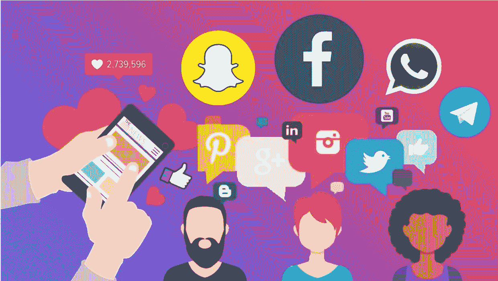

# 为什么出版商应该依靠自己的影响者来获得千禧一代的关注

> 原文：<https://medium.com/swlh/influencer-journalism-be7b0abaefba>

在社交媒体和病毒内容时代，数字影响者正在蓬勃发展，而许多传统媒体正在为生存而挣扎。

《经济咨询》的副主编，[营销专家丽贝卡·森坦斯](https://econsultancy.com/rebecca-sentance/)说:“在过去的九年里，社交媒体生态系统已经完全改变了。…的出现