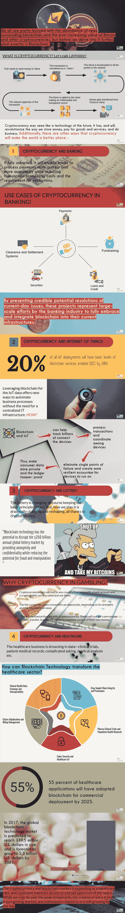

# 信息图——加密货币及其如何改变世界

> 原文：<https://medium.com/swlh/infographic-cryptocurrency-and-how-it-is-revolutionizing-the-world-d75abc2b6618>

加密货币看起来像是一项未来的技术，但它现在和将来都会通过将业务带到以前未开发的领域，进一步变革货币存储和交换的方式以及人们做生意的方式。Acc。据研究，到 2024 年，区块链市场预计将超过 3 万亿美元。像微软、戴尔、Expedia、彭博这样的科技巨头都接受比特币，其他公司也准备接受。小企业也不会错过这个机会。截至 2018 年 11 月，全球共有 3930 台比特币自动取款机。因此，变革正在到来，加密货币正走在彻底改变世界的正确道路上。让我们看看下面的这张信息图，探索几个我们有望利用加密货币让世界变得更美好的领域。

虽然专家们认为区块链是一个相对较新的概念，但创新的可能性是无穷的。除了上面列出的所有要点，加密货币还有很大的空间来彻底改变电子商务、娱乐业、保险、咨询和更多领域——无论是在个人还是专业领域。需要了解更多？[联系我们。](http://bit.ly/2SZnntN)

## 这篇文章发表在[《创业](https://medium.com/swlh)》上，这是 Medium 最大的创业刊物，有+412，714 人关注。

## 订阅接收[我们的头条新闻](http://growthsupply.com/the-startup-newsletter/)。

