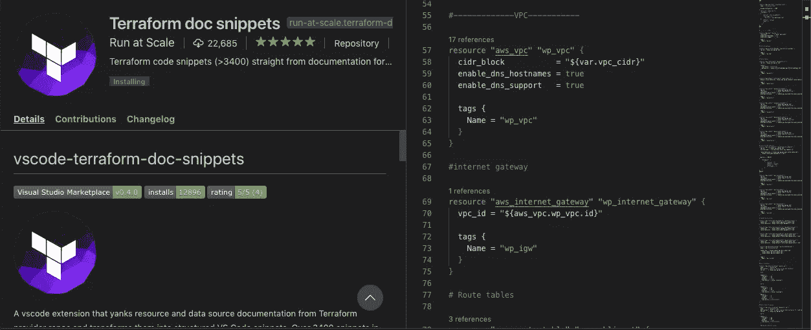

# 基础架构作为 AWS 上的代码—演示

> 原文：<https://medium.com/swlh/infrastructure-as-code-on-aws-demonstration-68e3b5f29ed1>

我寻求将如何在跨平台(包括 AWS、GCP 和 Azure)上部署基础设施标准化，并创建可重用的基础设施来帮助业务快速增长，这让我彻底改变了自己，并开始将基础设施作为代码进行部署。

有趣的是，许多云解决方案架构师和 DevOps 工程师对这个话题有些熟悉…