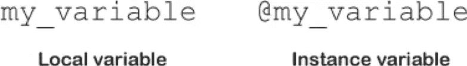

# 初始化、属性和它所做的一切

> 原文：<https://medium.com/swlh/initialization-attributes-and-all-that-it-does-6f6df0fb838f>

提示 2001:太空漫游音乐。咚…咚…咚…咚，咚。是的，我们将沉浸在创造新生活的荣耀中，因为，这就是我们将要做的，创造新生活，尽管是非常简单和虚拟的生活。就像电影结尾的婴儿一样，用 Ruby 创造一个新的人看起来很壮观(完全披露:我真的不明白电影中婴儿发生了什么)。

作为一个 Ruby 新手，这么多东西一开始看起来都很复杂。很难理解为什么某些事情是这样做的，而不是相反。Ruby 并不是我学习的第一门编程语言。是 JavaScript。在学习 JavaScript 的时候，很多事情对我来说都是一个谜，但即使是学习一门计算机语言，似乎也没有初始化和属性那么复杂。这就是我来这里的原因，来谈谈初始化和属性。如果我们要创造和解决这个虚拟而简单的生命之谜，理解这两个 Ruby 概念是必要的。那么，你现在已经掌握了这篇文章的要点。这是为那些刚刚开始学习或者在理解什么是初始化和属性方面有困难的人准备的。嘿，我们到底该拿这些家伙怎么办？

```
class Personattr_accessor :name, :age, :email, :gender, :heightdef initalize params@name = name               Mike@age = age                  25@email = email          Mike@gmail.comend
```

初始化可以想象成你在把一个东西引入我们的虚拟世界，并对它进行描述。为了更容易理解，我们要创造一个角色。那将是我们的事。初始化就像你写一个角色的描述一样。可以说，你初始化是为了在你的故事中使用角色的特征。你可能想从给你的角色起一个名字开始，或者如果我们的角色是一个学生，给一个年级，给一个年龄，或者尽可能多的你可能需要在你的故事中使用的描述性特征(实例变量)。

那么，让我们来认识一下我们的角色。我会给他起名为麦克，让他更有生气。


Hi, I am Mike!

初始化将允许 Ruby 在创建对象(我们的角色)时在幕后工作。Person = Person.new ("Mike ")

实例变量可以被一个类中的任何方法看到/访问。局部变量只能在声明它们的一个特定方法中访问。公平地说，实例变量比局部变量更强大，因为你可以用实例变量做更多的事情。



Difference between local variable and instance variable.

```
**attr_reader :age ------> would translate into this     def age
                                                         @age
                                                       end**
```

现在，让我们来谈谈属性和它们是什么。根据 David A. Black 和 Joe Leo 所著的《扎实的 Rubyist》一书，属性是对象的一种属性，其值可以通过对象来读取和/或写入。有两种属性类型:读者和作者。Attribute_reader 只是读取一个实例变量，并不对它做任何其他事情。如果您将 **age** 设置为 attribute_reader，它在属性表单中会是这样的，在右边，您会看到一个更明确的设置方式。

```
**attr_writer :message.    ------->        def age=(value)** **@age = value** **end**
```

同时，当您在 attr_writer 中设置属性时，您期望它在某一点被修改，但看不到它。

您也可以将这两种属性结合起来，使它们产生协同效应。然后你就有了 attr_reader 和 attr_writer。它执行 getter 和 setter 的工作。换句话说，它可以被修改和查看。

```
**attr_accessor :foo      ------------> def age=(value)
                                          @age = value
                                      end

                                      def age
                                        @age
                                      end**
```

理解属性和初始化的概念非常重要，因为这是所有事物工作和相互联系的方式。停下来深入研究细节是值得的，因为如果你纠结于这些概念，会变得更加困难。所以，你现在已经创造了迈克。你对他了解一点点(好吧，没那么多。我们只是初学者)，你可以使用这些属性让我们的角色(对象)做一些事情。在 Ruby 中，我们虚拟生命的大部分创造都是由于属性和初始化。这可能不会像在《2001:太空漫游》中看到宇宙中的生命起源那样令人惊讶，但宇宙中的生命比迈克的宇宙多发展了几十亿年。我希望这篇教程能帮助你消除一些困惑。请就如何更容易地解释这一概念提出建议。