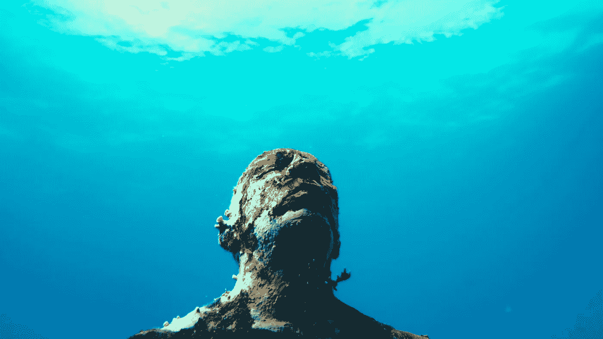

# 直觉的力量

> 原文：<https://medium.com/swlh/inns%C3%A6i-the-power-of-intuition-e6197d22f8bc>

Image source zeitgeistfilms.com

> 直觉将我们联系在一起。没有它，我们就会失去目标感和归属感。” —马利多马·索姆

我最近看了一部关于直觉力量的纪录片《Innsæ》。这部电影探索了我们能够从内心深处感知事物的能力，超越我们的五官和理性思维来感知和理解我们周围的世界。我真的很喜欢这部纪录片，觉得它发人深省，鼓舞人心。

Innsæ是古冰岛语中直觉的意思，翻译过来有三个意思:*内的海，我们内心世界的无边界性质，一个超越言语的视觉、感觉和想象的不断移动的世界；*要在*之内看到，要认识自己，要足够了解自己，才能设身处地为别人着想；从内到外看问题，拥有强大的内心指南针，引领你进入这个不断变化的世界。*

*电影制作人 Hrund Gunnsteinsdóttir 带领我们踏上了一次全球之旅，来揭示我们世界中的分心、脱节和压力是如何影响我们的生活的。一路上，她会见了著名的思想家，艺术家和迷人的精神领袖，讨论直觉和移情的意义，以创造有意义的人类联系。*

*以下是我注意到的几点。*

## *直觉和意识*

> **“看看你，看看我们周围。人们不快乐，我们完全脱离了大脑和身体。这么多人活在脑袋里，不带感情。”* —玛丽娜·阿布拉莫维奇*

*我们生活在一个被信息和商业信息轰炸的世界里。所有这些外部噪音正在使我们在有形的意义上联系更少，与真实的自我和他人更加脱节。这种噪音屏蔽了我们的内心世界，阻碍了我们的直觉。*

*直觉是与当下和我们周围的一切合拍。直觉是我们心灵的固有部分，是帮助我们在这个层面运作的第六感。这是内心渴望被听到的声音。你有过直觉吗？你有没有做过内心觉得不对的决定？那是你的直觉在引导你。*

*我们现代社会的问题是，我们已经变得严重依赖逻辑和客观推理，这导致了一个超级连接，但又不连接的世界。智慧已经被知识所取代，而知识又被信息所取代。*

> *“我由两个节奏组成。一个是分析性的，逻辑性的。另一个是创造性和直觉性的。我完全忽略了直觉。” — Hrund Gunnsteinsdóttir*

*当我们学会如何平衡直觉和逻辑，“通过由内而外有意识地感知世界，而不仅仅是由外而内，”我们将能够让我们的生活变得更好。*

## *直觉和自然*

*倦怠、分心和暴力已经成为我们文化、媒体和娱乐不可或缺的一部分，我们正变得与自然世界严重脱节。这些年来，人们在大自然中度过的时间急剧减少，这对我们的健康不利。*

*Hrund 探索了历史上和现在的自然经验如何帮助建立直觉。古代文明在广阔的海洋和沙漠中漫游，没有使用导航工具，而是仅仅使用他们的感官、自然经验和世代相传的知识。*

*我们都知道，花时间在大自然中可以减少压力，提高我们的创造力，有助于减少抑郁情绪，甚至可以改变我们对生活的看法。然而，随着技术的进步和整合，我们已经忘记了如何使用我们所有的感官来体验和联系我们周围的自然世界。我们让我们的意识从自然世界漂移到我们创造的世界。*

*也可以说，这种与地球的脱节导致了我们对环境的不当对待。*

> *自然是直觉的无声见证。大自然用各种语言说话。自然对内在的眼睛、内在的耳朵感兴趣，内在的能力使外在意识认为混乱的东西变得有意义。没有自然，我不知道我们如何才能重振直觉。” —马利多马·索姆*

## *直觉和恐惧*

*恐惧是直觉的最大障碍。害怕失败。对未知的恐惧。*

*行为艺术家玛丽娜·阿布拉莫维奇认为，如果我们想改变我们的生活和我们自己，进入未知世界是绝对必要的。通过进入未知领域的旅程，我们向变化、新的可能性和新的经历敞开心扉。但是我们也向失败敞开心扉，我们必须接受失败，把它作为我们旅程的一部分。*

*成长只有在你走出舒适区时才会发生。生活如此，商业如此，艺术也是如此。有时你需要越过边缘，看看你能做什么，面对悬崖是一件可怕的事情。直觉帮助我们克服恐惧，这样我们就可以做那些我们内心感觉可以帮助我们前进的事情。*

> **“直觉是对注意力焦点之外的微妙事物的意识，我们潜意识里、无意识地意识到的事物。”伊恩·麦克吉尔克里斯特**

*如果你有兴趣了解更多关于 Innsæ的信息，你可以在 [Vimeo](https://vimeo.com/ondemand/innsaei/213681887) 上找到预告片和完整纪录片。如果你有机会观看这部纪录片，我很乐意在下面的评论框中听到你的想法。*

*感谢您的阅读。*

**本文原载于 silviokramar.com***。***