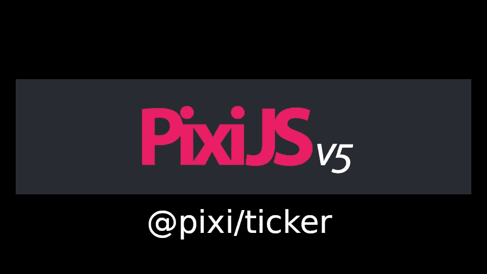

# 在 PixiJS 的高性能更新循环中

> 原文：<https://medium.com/swlh/inside-pixijss-high-performance-update-loop-856fb1d841a0>

为 PixiJS 的团队优化最小的事物而欢呼！

PixiJS logo embedded in a background

PixiJS 是一个 2D 图形库，用于基于画布的网络应用。它依靠`@pixi/ticker`包来及时管理渲染更新。在这里，我想分享一下我们可以从中学到什么样的优化和设计技巧。

# 股票行情