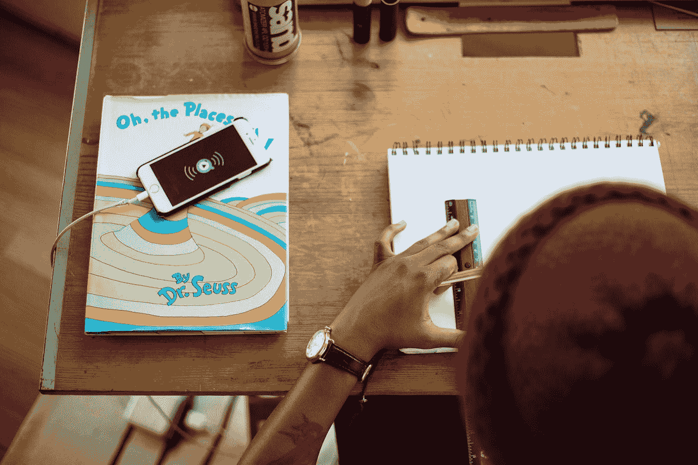

# 灵感和分心——区别

> 原文：<https://medium.com/swlh/inspiration-and-distraction-the-difference-4ef49667b08d>

## 灵感会推动你的工作向前发展。

Photo by [Tamarcus Brown](https://unsplash.com/@tamarcusbrown?utm_source=medium&utm_medium=referral) on [Unsplash](https://unsplash.com?utm_source=medium&utm_medium=referral)

灵感和分心是有区别的。

灵感会推动你的工作向前发展。

分心是一个贪婪的小贼，它会偷走你的时间，吸走你的能量，直到你没有欲望去创造你设定的任何东西…