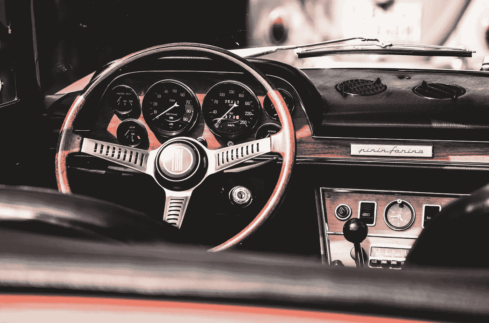

# 灵感是不可靠的创意燃料

> 原文：<https://medium.com/swlh/inspiration-is-unreliable-creative-fuel-fab14c3d65ec>

## 不要学得太辛苦(像我一样[🤦🏾](https://emojipedia.org/man-facepalming-type-5/))。

Photo by [Frank Albrecht](https://unsplash.com/photos/0ncoCGNpDOM?utm_source=unsplash&utm_medium=referral&utm_content=creditCopyText) on [Unsplash](https://unsplash.com/search/photos/gas?utm_source=unsplash&utm_medium=referral&utm_content=creditCopyText)

# 作为一名艺术家，我把我的心放在灵感上。我很难预测自己的一致性，这是我最糟糕的习惯之一。