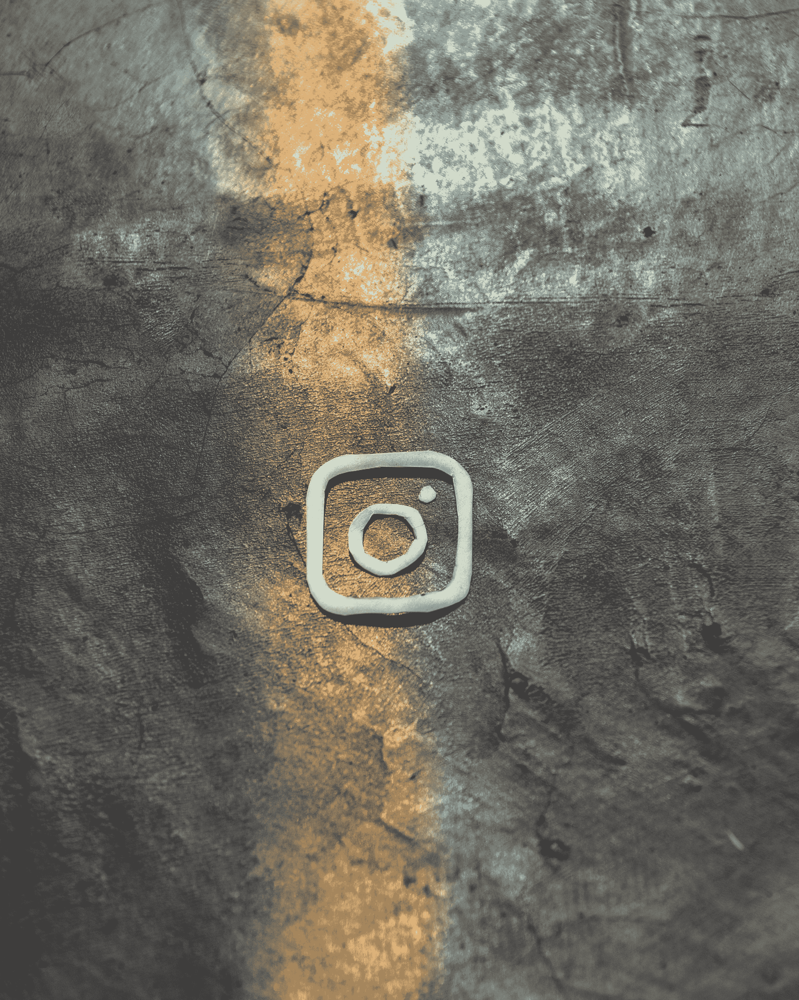

# Instagram 是魔鬼的后代

> 原文：<https://medium.com/swlh/instagram-is-the-devils-spawn-62bc38c05827>

## 我不是指好的方面。

Photo by [lalo Hernandez](https://unsplash.com/@lalonchera?utm_source=medium&utm_medium=referral) on [Unsplash](https://unsplash.com?utm_source=medium&utm_medium=referral)

几千年来，人类文化给了我们许多无用的发明。但是我很难想出一个比 Instagram 更没用的。

(我居然[搜到了这个](https://www.dailyedge.ie/the-most-useless-inventions-ever-made-1101958-Oct2013/)。作为一个拥有博士学位的人，我非常认真地对待我为我的文章所做的研究。但是尽管我尽了最大努力，我还是看不出鳄梨储蓄器有什么用处…