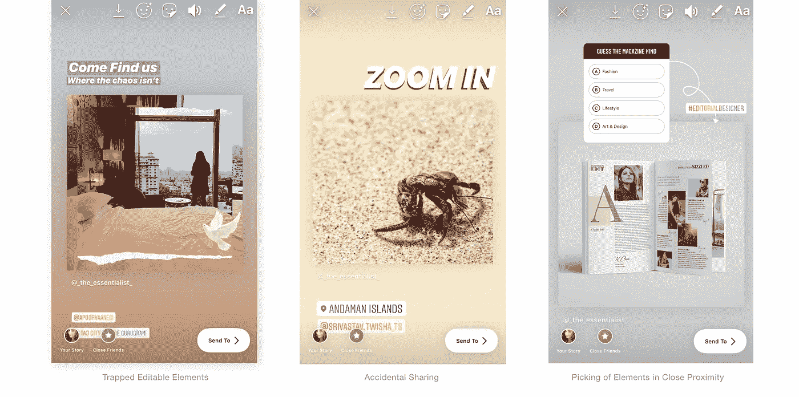

# Instagram 故事| UX 挑战

> 原文：<https://medium.com/swlh/instagram-stories-ux-challenges-649433eebe55>

## *UX 的缺陷使社交媒体管理成为品牌的持续斗争*

UX Flaws encountered during the creation & curation of IG Stories

我定位于数字营销领域，是一名社交媒体专业人士，生活在 Instagram 的海洋中。

在工作时，我经常在平台上——整理我的品牌信息和故事，以激励和吸引我们的追随者；关闭…